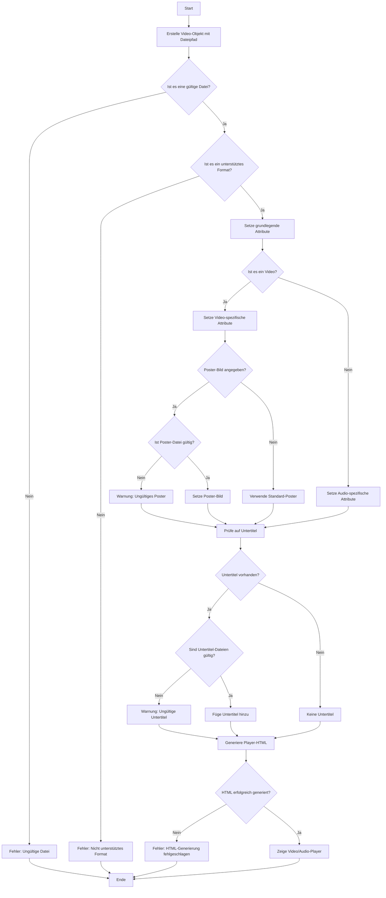

# [Vidstack.io](https://www.vidstack.io) für REDAXO# [Vidstack.io](https://www.vidstack.io) für REDAXO# [Vidstack.io](https://www.vidstack.io) for REDAXO


Eine moderne PHP-Klasse für elegante Video-Einbindung: YouTube, Vimeo, lokale Videos - alles mit einem schönen Player und DSGVO-konform dank Consent Manager Integration.


---


## 🚀 SchnellstartEine moderne PHP-Klasse für elegante Video-Einbindung: YouTube, Vimeo, lokale Videos - alles mit einem schönen Player und DSGVO-konform dank Consent Manager Integration.## Was ist das hier?


### Installation


Via REDAXO-Installer oder als GitHub Release.---Eine PHP-Klasse, die Videos auf Websites einbindet - mit Style! YouTube, Vimeo oder eigene Videos? Alles kein Problem. Und das Beste? Es ist so einfach zu benutzen, dass selbst ein Kater es könnte (wenn er Daumen hätte).


### Frontend-Integration


```php## 🚀 Schnellstart## 🌟 Neue Features (Phase 1)

// Im Template <head> oder vor </body>:


// CSS

echo '<link rel="stylesheet" href="' . rex_url::addonAssets('vidstack', 'vidstack.css') . '">';### InstallationDas Addon wurde massiv vereinfacht und modernisiert:

echo '<link rel="stylesheet" href="' . rex_url::addonAssets('vidstack', 'vidstack_helper.css') . '">';


// JavaScript

echo '<script src="' . rex_url::addonAssets('vidstack', 'vidstack.js') . '"></script>';Via REDAXO-Installer oder als GitHub Release.### ⛓️ Fluent Interface - Sauberer Code durch Method Chaining

echo '<script src="' . rex_url::addonAssets('vidstack', 'vidstack_helper.js') . '"></script>';

```Alle Methoden geben `$this` zurück, was elegantes Chaining ermöglicht:


---### Frontend-Integration


## 🎯 Die neue API (v2.0+)```php


### Factory Methods - Der einfache Einstieg```php$video = Video::local('video.mp4', 'Tutorial')


```php// Im Template <head> oder vor </body>:    ->setPoster('thumb.jpg')

use FriendsOfRedaxo\VidStack\Video;

    ->setAspectRatio('16/9')

// YouTube (automatische URL-Erkennung + Consent Manager Integration)

$video = Video::youtube('https://www.youtube.com/watch?v=dQw4w9WgXcQ', 'Rick Astley')// CSS    ->addChapters('chapters.vtt')

    ->autoplay()

    ->loop();echo '<link rel="stylesheet" href="' . rex_url::addonAssets('vidstack', 'vidstack.css') . '">';    ->enableResume();

echo $video->generateFull();

echo '<link rel="stylesheet" href="' . rex_url::addonAssets('vidstack', 'vidstack_helper.css') . '">';```

// Vimeo

$video = Video::vimeo('https://vimeo.com/148751763', 'Mein Vimeo Video')

    ->setPoster('vorschau.jpg');

echo $video->generateFull();// JavaScript### 🏭 Factory-Methoden - Weniger Boilerplate


// Lokales Video (mit Smart Defaults: playsInline, preload)echo '<script src="' . rex_url::addonAssets('vidstack', 'vidstack.js') . '"></script>';```php

$video = Video::local('video.mp4', 'Mein Video')

    ->setPoster('thumb.jpg')echo '<script src="' . rex_url::addonAssets('vidstack', 'vidstack_helper.js') . '"></script>';Video::youtube($url, $title)   // YouTube mit Smart Defaults

    ->setAspectRatio('16/9')

    ->addCaptions('subtitles.vtt');```Video::vimeo($url, $title)     // Vimeo optimiert

echo $video->generateFull();

Video::local($filename, $title) // Lokale Videos mit playsInline

// Tutorial-Video (mit automatischer Resume-Funktion)

$video = Video::tutorial('tutorial.mp4', 'REDAXO Tutorial')---Video::tutorial($source, $title) // Mit Resume-Funktion

    ->setPoster('thumb.jpg')

    ->addChapters('kapitel.vtt')```

    ->enableResume();

echo $video->generateFull();## 🎯 Die neue API (v2.0+)

```

### 📐 Aspect Ratio - Verhindert Layout-Shift

### Fluent Interface - Method Chaining

### Factory Methods - Der einfache Einstieg```php

Alle Methoden geben `$this` zurück → elegantes Chaining:

$video->setAspectRatio('16/9');  // Auch: '4/3', '21/9', '1/1'

```php

$video = Video::local('produkt.mp4', 'Produktvideo')```php```

    ->setPoster('preview.jpg', 'Produktvorschau')

    ->setAspectRatio('16/9')use FriendsOfRedaxo\VidStack\Video;

    ->setLoadStrategy('visible')

    ->addChapters('chapters.vtt')### ⚡ Loading Strategy - Performance-Optimierung

    ->addCaptions('de.vtt', 'Deutsch', true)

    ->addCaptions('en.vtt', 'English')// YouTube (automatische URL-Erkennung + Consent Manager Integration)```php

    ->autoplay()

    ->muted();$video = Video::youtube('https://www.youtube.com/watch?v=dQw4w9WgXcQ', 'Rick Astley')$video->setLoadStrategy('idle');  

echo $video->generateFull();

```    ->autoplay()// 'eager' → Sofort laden


---    ->loop();// 'idle' → Laden wenn Browser idle


## 🌟 Neue Features in v2.0echo $video->generateFull();// 'visible' → Laden wenn sichtbar (Standard)


### 1️⃣ Aspect Ratio - Verhindert Layout Shift// 'play' → Erst beim Abspielen laden


```php// Vimeo```

$video = Video::local('video.mp4')

    ->setAspectRatio('16/9');  // Standard Breitbild$video = Video::vimeo('https://vimeo.com/148751763', 'Mein Vimeo Video')


// Weitere Optionen:    ->setPoster('vorschau.jpg');### 💾 Resume - Position automatisch merken

->setAspectRatio('4/3')   // Klassisch

->setAspectRatio('21/9')  // Ultrawide/Kinoecho $video->generateFull();```php

->setAspectRatio('1/1')   // Quadratisch (Instagram)

```$video->enableResume();              // Auto Storage-Key


**Vorteil:** Verhindert Cumulative Layout Shift (CLS), bessere Core Web Vitals!// Lokales Video (mit Smart Defaults: playsInline, preload)$video->enableResume('mein-tutorial'); // Custom Key


### 2️⃣ Loading Strategy - Performance-Optimierung$video = Video::local('video.mp4', 'Mein Video')```


```php    ->setPoster('thumb.jpg')

$video = Video::local('video.mp4')

    ->setLoadStrategy('idle');    ->setAspectRatio('16/9')### 📑 Chapters & Captions - Vereinfacht


// Strategien:    ->addCaptions('subtitles.vtt');```php

->setLoadStrategy('eager')    // Sofort laden

->setLoadStrategy('idle')     // Laden wenn Browser idleecho $video->generateFull();$video->addChapters('chapters.vtt');         // Kapitel-Navigation

->setLoadStrategy('visible')  // Laden wenn sichtbar (Standard)

->setLoadStrategy('play')     // Erst beim Abspielen laden$video->addCaptions('subtitles.vtt');        // Standard-Untertitel

```

// Tutorial-Video (mit automatischer Resume-Funktion)$video->addCaptions('de.vtt', 'Deutsch', true); // Mit Label

**Vorteil:** Optimiert Page Load, reduziert initiale Bandwidth!

$video = Video::tutorial('tutorial.mp4', 'REDAXO Tutorial')```

### 3️⃣ Resume Support - Position merken

    ->setPoster('thumb.jpg')

```php

// Automatischer Storage-Key    ->addChapters('kapitel.vtt')### 🎬 Convenience-Methoden

$video = Video::tutorial('tutorial.mp4')

    ->enableResume();    ->enableResume();```php


// Custom Storage-Key (für mehrere Videos)echo $video->generateFull();$video->autoplay();  // Autoplay mit Mute

$video = Video::local('lesson-01.mp4')

    ->enableResume('kurs-lesson-01');```$video->loop();      // Endlos-Schleife

```

$video->muted();     // Stumm schalten

**Vorteil:** User kann Video fortsetzen wo aufgehört - perfekt für Tutorials!

### Fluent Interface - Method Chaining```

### 4️⃣ Chapters - Kapitel-Navigation


```php

$video = Video::local('long-video.mp4')Alle Methoden geben `$this` zurück → elegantes Chaining:### 🎯 Smart Defaults

    ->addChapters('chapters.vtt');

```Das Addon setzt automatisch sinnvolle Standardwerte:


**chapters.vtt Beispiel:**```php- `playsInline="true"` für Mobile

```vtt

WEBVTT$video = Video::local('produkt.mp4', 'Produktvideo')- `preload="metadata"` für Performance


00:00:00.000 --> 00:01:30.000    ->setPoster('preview.jpg', 'Produktvorschau')

Einleitung

    ->setAspectRatio('16/9')## 🚀 Los geht's!

00:01:30.000 --> 00:05:00.000

Hauptteil    ->setLoadStrategy('visible')


00:05:00.000 --> 00:07:00.000    ->addChapters('chapters.vtt')### Installation

Zusammenfassung

```    ->addCaptions('de.vtt', 'Deutsch', true)


### 5️⃣ Convenience Methods    ->addCaptions('en.vtt', 'English')Klar, natürlich über den REDAXO-Installer oder als GitHub Release. Aber das war's noch nicht ganz:


```php    ->autoplay()

$video = Video::youtube('https://youtube.com/watch?v=xyz')

    ->autoplay()     // Autoplay mit Mute (Browser-konform)    ->muted();#### Für das Frontend:

    ->loop()         // Endlos-Schleife

    ->muted();       // Stumm schaltenecho $video->generateFull();


// Untertitel vereinfacht```Jetzt kommt der interessante Teil - wir müssen noch ein paar Dateien in unser Frontend einbinden, damit der ganze Zauber funktioniert. Hier ist, was du brauchst:

$video->addCaptions('subtitles.vtt');                    // Einfach

$video->addCaptions('de.vtt', 'Deutsch', true);         // Mit Label + Default

```

---```php

---

// In deinem Template oder an einer anderen passenden Stelle:

## 📚 Alle Methoden

## 🌟 Neue Features in v2.0

### ✨ Factory Methods (NEU)

// CSS einbinden

| Methode | Beschreibung |

|---------|--------------|### 1️⃣ Aspect Ratio - Verhindert Layout Shiftecho '<link rel="stylesheet" href="' . rex_url::addonAssets('vidstack', 'vidstack.css') . '">';

| `Video::youtube($url, $title)` | YouTube mit Consent Manager Integration |

| `Video::vimeo($url, $title)` | Vimeo mit Consent Manager Integration |echo '<link rel="stylesheet" href="' . rex_url::addonAssets('vidstack', 'vidstack_helper.css') . '">';

| `Video::local($filename, $title)` | Lokales Video mit Smart Defaults |

| `Video::tutorial($source, $title)` | Mit automatischer Resume-Funktion |```php


### ⚡ Phase 1 Features (NEU)$video = Video::local('video.mp4')// JavaScript einbinden


| Methode | Parameter | Beschreibung |    ->setAspectRatio('16/9');  // Standard Breitbildecho '<script src="' . rex_url::addonAssets('vidstack', 'vidstack.js') . '"></script>';

|---------|-----------|--------------|

| `setAspectRatio()` | `'16/9'`, `'4/3'`, `'21/9'`, `'1/1'` | Verhindert Layout Shift |echo '<script src="' . rex_url::addonAssets('vidstack', 'vidstack_helper.js') . '"></script>';

| `setLoadStrategy()` | `'eager'`, `'idle'`, `'visible'`, `'play'` | Performance-Optimierung |

| `enableResume()` | `?string $storageKey` | Position automatisch merken |// Weitere Optionen:```

| `addChapters()` | `string $vttFile` | Kapitel-Navigation |

| `addCaptions()` | `string $vtt, string $label, bool $default` | Untertitel vereinfacht |->setAspectRatio('4/3')   // Klassisch

| `autoplay()` | - | Autoplay mit Mute |

| `loop()` | - | Endlos-Schleife |->setAspectRatio('21/9')  // Ultrawide/KinoWas passiert hier? Wir benutzen `rex_url::addonAssets()`, um die richtigen URLs für unsere Assets zu generieren. Das ist wie ein Zauberstab, der immer auf die korrekten Dateien in deinem REDAXO-Setup zeigt, egal wo sie sich versteckt haben.

| `muted()` | `bool $muted = true` | Stumm schalten |

->setAspectRatio('1/1')   // Quadratisch (Instagram)

### 🔧 Basis-Methoden (weiterhin verfügbar)

```Die `vidstack.css` und `vidstack.js` sind die Hauptdarsteller - sie bringen den Video-Player zum Laufen. Die `*_helper`-Dateien sind wie die fleißigen Backstage-Helfer. Sie kümmern sich um Extras wie Übersetzungen und andere nützliche Funktionen.

| Methode | Parameter | Beschreibung |

|---------|-----------|--------------|

| `new Video()` | `string $source, string $title, string $lang` | Konstruktor (auch mit Factory Methods nutzbar) |

| `setAttributes()` | `array $attributes` | Setzt HTML-Attribute |**Vorteil:** Verhindert Cumulative Layout Shift (CLS), bessere Core Web Vitals!So, jetzt aber! Dein REDAXO ist jetzt bereit, Videos mit Style zu servieren. 🎬🍿

| `setAttribute()` | `string $key, mixed $value` | Setzt einzelnes Attribut |

| `setPoster()` | `string $src, string $alt` | Setzt Vorschaubild |

| `setThumbnails()` | `string $url` | Setzt Thumbnail-Sprites |

| `addSubtitle()` | `string $src, string $kind, string $label, string $lang, bool $default` | Fügt Untertitel/Chapters hinzu |### 2️⃣ Loading Strategy - Performance-Optimierung### Source Sizes für Desktop/Mobile Videos

| `setSources()` | `array $sources` | Mehrere Video-Quellen (Multi-Resolution) |

| `setResponsiveSources()` | `string $desktopSrc, string $mobileSrc, ?array $desktopSize, ?array $mobileSize` | Desktop/Mobile Video-Varianten |

| `setResponsiveSourcesWithPresets()` | `string $desktopSrc, string $mobileSrc, string $desktopPreset, string $mobilePreset` | Mit Presets (2k, 1080p, 720p, etc.) |

| `createAutoSources()` | `string $baseFilename` | Automatische Quellen aus Dateiname-Pattern |```phpMit dem Vidstack-Addon können Sie verschiedene Video-Auflösungen für Desktop und Mobile bereitstellen:

| `setA11yContent()` | `string $content` | Barrierefreie Zusatzinformationen |

| `generate()` | - | Generiert Player-HTML |$video = Video::local('video.mp4')

| `generateFull()` | - | Generiert Player mit Wrapper + Consent Manager |

    ->setLoadStrategy('idle');```php

---

<?php

## 💡 Praktische Beispiele

// Strategien:use FriendsOfRedaxo\VidStack\Video;

### YouTube mit Autoplay

->setLoadStrategy('eager')    // Sofort laden

```php

$video = Video::youtube('https://www.youtube.com/watch?v=dQw4w9WgXcQ', 'Rick Astley')->setLoadStrategy('idle')     // Laden wenn Browser idle// Einfache Desktop/Mobile Setup mit Standard-Auflösungen

    ->autoplay()

    ->loop();->setLoadStrategy('visible')  // Laden wenn sichtbar (Standard)$video = new Video('video-desktop.mp4', 'Responsives Video');

echo $video->generateFull();

```->setLoadStrategy('play')     // Erst beim Abspielen laden$video->setResponsiveSources('video-1080p.mp4', 'video-480p.mp4');


**DSGVO:** Consent Manager blockiert automatisch YouTube, bis User zustimmt!```echo $video->generateFull();


### Lokales Video mit allem Drum und Dran


```php**Vorteil:** Optimiert Page Load, reduziert initiale Bandwidth!// Mit benutzerdefinierten Auflösungen

$video = Video::local('produkt.mp4', 'Produktvideo')

    ->setPoster('preview.jpg', 'Produktvorschau')$video = new Video('video-desktop.mp4', 'Custom Responsive Video');

    ->setAspectRatio('16/9')

    ->setLoadStrategy('visible')### 3️⃣ Resume Support - Position merken$video->setResponsiveSources(

    ->addCaptions('de.vtt', 'Deutsch', true)

    ->addCaptions('en.vtt', 'English')    'video-high.mp4', 

    ->addChapters('chapters.vtt');

echo $video->generateFull();```php    'video-low.mp4',

```

// Automatischer Storage-Key    [2560, 1440], // Desktop: 2K

### Tutorial mit Resume-Funktion

$video = Video::tutorial('tutorial.mp4')    [960, 540]    // Mobile: Mobile HD

```php

$video = Video::tutorial('redaxo-tutorial.mp4', 'REDAXO Grundlagen')    ->enableResume(););

    ->setPoster('thumbnail.jpg')

    ->addChapters('chapters.vtt')echo $video->generateFull();

    ->setAspectRatio('16/9')

    ->setLoadStrategy('idle');// Custom Storage-Key (für mehrere Videos)

echo $video->generateFull();

```$video = Video::local('lesson-01.mp4')// Mit Auflösungspresets


**Automatisch:** Position wird gespeichert, User kann fortsetzen!    ->enableResume('kurs-lesson-01');$video = new Video('video.mp4', 'Preset Video');


### Barrierefreies Video```$video->setResponsiveSourcesWithPresets('video-2k.mp4', 'video-mobile.mp4', '2k', 'mobile_hd');


```phpecho $video->generateFull();

$video = Video::local('video.mp4', 'Barrierefreies Video')

    ->setPoster('preview.jpg')**Vorteil:** User kann Video fortsetzen wo aufgehört - perfekt für Tutorials!

    ->addCaptions('de.vtt', 'Deutsch', true)

    ->setA11yContent('// Automatische Erstellung aus Dateinamen-Pattern

        <h3>Videoinhalt</h3>

        <p>Dieses Video zeigt...</p>### 4️⃣ Chapters - Kapitel-Navigation$video = new Video('produktvideo.mp4', 'Produktvideo');

        <ul>

            <li>Punkt 1</li>if ($video->createAutoSources('produktvideo')) {

            <li>Punkt 2</li>

        </ul>```php    // Sucht automatisch nach: produktvideo-1080p.mp4, produktvideo-720p.mp4, produktvideo-480p.mp4

    ');

echo $video->generateFull();$video = Video::local('long-video.mp4')    echo $video->generateFull();

```

    ->addChapters('chapters.vtt');}

### Audio-Player

```

```php

$video = Video::local('podcast.mp3', 'Mein Podcast')// Mehrere Qualitätsstufen mit manueller Kontrolle

    ->setAttribute('audio', true);

echo $video->generateFull();**chapters.vtt Beispiel:**$video = new Video('video.mp4', 'Multi-Quality Video');

```

```vtt$video->setSources([

---

WEBVTT    ['src' => 'video-4k.mp4', 'width' => 3840, 'height' => 2160, 'type' => 'video/mp4'],

## 🎬 Responsive Videos (Multi-Resolution)

    ['src' => 'video-1080p.mp4', 'width' => 1920, 'height' => 1080, 'type' => 'video/mp4'],

### Desktop/Mobile mit Presets

00:00:00.000 --> 00:01:30.000    ['src' => 'video-720p.mp4', 'width' => 1280, 'height' => 720, 'type' => 'video/mp4'],

```php

$video = Video::local('video.mp4', 'Responsives Video')Einleitung    ['src' => 'video-480p.mp4', 'width' => 854, 'height' => 480, 'type' => 'video/mp4']

    ->setResponsiveSourcesWithPresets(

        'video-1080p.mp4',  // Desktop]);

        'video-480p.mp4',   // Mobile

        '1080p',            // Desktop Preset00:01:30.000 --> 00:05:00.000echo $video->generateFull();

        'mobile_sd'         // Mobile Preset

    )Hauptteil```

    ->setPoster('preview.jpg');

echo $video->generateFull();

```

00:05:00.000 --> 00:07:00.000**Verfügbare Auflösungspresets:**

**Verfügbare Presets:**

- `4k`: 3840×2160Zusammenfassung- `4k` (3840×2160), `2k` (2560×1440), `1080p` (1920×1080)

- `2k`: 2560×1440

- `1080p`: 1920×1080```- `720p` (1280×720), `480p` (854×480), `360p` (640×360)

- `720p`: 1280×720

- `480p`: 854×480- `mobile_hd` (960×540), `mobile_sd` (640×360), `tablet` (1024×576)

- `mobile_hd`: 960×540

- `mobile_sd`: 640×360### 5️⃣ Convenience Methods


### Automatische Quellen aus Dateiname-Pattern**Wie es funktioniert:** Der Browser wählt automatisch die beste verfügbare Quelle basierend auf Gerätegröße und Netzwerkbedingungen. Die Quellen werden nach Qualität sortiert ausgegeben (höchste zuerst). Das Sorting wird gecacht für bessere Performance.


```php```php

$video = Video::local('video.mp4', 'Auto-Quality Video');

if ($video->createAutoSources('video')) {$video = Video::youtube('https://youtube.com/watch?v=xyz')### 🔄 Vorher vs. Nachher - Wie viel einfacher es geworden ist

    // Sucht automatisch nach:

    // - video-1080p.mp4    ->autoplay()     // Autoplay mit Mute (Browser-konform)

    // - video-720p.mp4

    // - video-480p.mp4    ->loop()         // Endlos-Schleife#### Altes API (vor Phase 1)

    echo $video->generateFull();

}    ->muted();       // Stumm schalten```php

```

$video = new Video('tutorial.mp4', 'Mein Tutorial');

### Manuelle Multi-Resolution

// Untertitel vereinfacht$video->setPoster('thumb.jpg');

```php

$video = Video::local('video.mp4', 'Multi-Quality Video')$video->addCaptions('subtitles.vtt');                    // Einfach$video->setAttributes(['data-aspect-ratio' => '16/9']);

    ->setSources([

        ['src' => 'video-4k.mp4', 'width' => 3840, 'height' => 2160, 'type' => 'video/mp4'],$video->addCaptions('de.vtt', 'Deutsch', true);         // Mit Label + Default$video->addSubtitle('chapters.vtt', 'Chapters', 'en', 'chapters', false);

        ['src' => 'video-1080p.mp4', 'width' => 1920, 'height' => 1080, 'type' => 'video/mp4'],

        ['src' => 'video-720p.mp4', 'width' => 1280, 'height' => 720, 'type' => 'video/mp4'],```$video->addSubtitle('subtitles.vtt', 'Deutsch', 'de', 'captions', true);

    ]);

echo $video->generateFull();$video->setAttributes(array_merge($video->getAttributes() ?? [], [

```

---    'autoplay' => 'true',

---

    'muted' => 'true',

## 🔒 DSGVO & Consent Manager

## 📚 Alle Methoden    'loop' => 'true'

### Automatische Integration

]));

Ab Version 2.0.0 integriert Vidstack automatisch mit dem [Consent Manager AddOn](https://github.com/FriendsOfREDAXO/consent_manager):

### ✨ Factory Methods (NEU)echo $video->generateFull();

```php

// YouTube wird automatisch blockiert bis zur Einwilligung```

$video = Video::youtube('https://youtube.com/watch?v=xyz', 'Mein Video')

    ->setPoster('preview.jpg');  // Poster wird als Platzhalter genutzt| Methode | Beschreibung |

echo $video->generateFull();

```|---------|--------------|#### Neues API (Phase 1)


**Was passiert:**| `Video::youtube($url, $title)` | YouTube mit Consent Manager Integration |```php

1. ✅ Video wird automatisch erkannt (YouTube/Vimeo)

2. ✅ Consent Manager blockiert Einbettung| `Video::vimeo($url, $title)` | Vimeo mit Consent Manager Integration |$video = Video::tutorial('tutorial.mp4', 'Mein Tutorial')

3. ✅ Poster-Bild wird als Thumbnail genutzt

4. ✅ Nach Einwilligung: Video lädt automatisch| `Video::local($filename, $title)` | Lokales Video mit Smart Defaults |    ->setPoster('thumb.jpg')


### Erforderliche Consent Manager Services| `Video::tutorial($source, $title)` | Mit automatischer Resume-Funktion |    ->setAspectRatio('16/9')


Im Consent Manager müssen folgende Service-UIDs angelegt sein:    ->addChapters('chapters.vtt')

- `youtube` für YouTube-Videos

- `vimeo` für Vimeo-Videos### ⚡ Phase 1 Features (NEU)    ->addCaptions('subtitles.vtt', 'Deutsch', true)


### Ohne Consent Manager    ->autoplay()


Wenn Consent Manager nicht installiert ist, werden Videos direkt geladen (Graceful Degradation).| Methode | Parameter | Beschreibung |    ->loop();


---|---------|-----------|--------------|echo $video->generateFull();


## 🔄 URL-Autoerkennung| `setAspectRatio()` | `'16/9'`, `'4/3'`, `'21/9'`, `'1/1'` | Verhindert Layout Shift |```


Das AddOn erkennt automatisch YouTube- und Vimeo-URLs:| `setLoadStrategy()` | `'eager'`, `'idle'`, `'visible'`, `'play'` | Performance-Optimierung |


```php| `enableResume()` | `?string $storageKey` | Position automatisch merken |**Unterschied:** 

// Alle diese Varianten funktionieren:

| `addChapters()` | `string $vttFile` | Kapitel-Navigation |- ✅ **8 Zeilen → 8 verkettete Aufrufe** (aber viel lesbarer!)

// YouTube

new Video('https://www.youtube.com/watch?v=dQw4w9WgXcQ', 'Titel');| `addCaptions()` | `string $vtt, string $label, bool $default` | Untertitel vereinfacht |- ✅ **Keine manuelle Array-Manipulation** mehr nötig

new Video('https://youtu.be/dQw4w9WgXcQ', 'Titel');

Video::youtube('https://www.youtube.com/watch?v=dQw4w9WgXcQ', 'Titel');| `autoplay()` | - | Autoplay mit Mute |- ✅ **Selbsterklärende Methoden** wie `autoplay()` statt kryptischem Array


// Vimeo| `loop()` | - | Endlos-Schleife |- ✅ **Factory-Methoden** mit Smart Defaults (`Video::tutorial()`)

new Video('https://vimeo.com/148751763', 'Titel');

new Video('https://player.vimeo.com/video/148751763', 'Titel');| `muted()` | `bool $muted = true` | Stumm schalten |- ✅ **Spezielle Methoden** wie `addChapters()` statt generischem `addSubtitle()`

Video::vimeo('https://vimeo.com/148751763', 'Titel');


// Lokale Dateien

new Video('video.mp4', 'Titel');### 🔧 Basis-Methoden (weiterhin verfügbar)### Grundlegende Verwendung

new Video('media://video.mp4', 'Titel');

Video::local('video.mp4', 'Titel');

```

| Methode | Parameter | Beschreibung |```php

**Tipp:** Factory Methods sind der empfohlene Weg, da sie optimale Defaults setzen!

|---------|-----------|--------------|<?php

---

| `new Video()` | `string $source, string $title, string $lang` | Konstruktor (auch mit Factory Methods nutzbar) |use FriendsOfRedaxo\VidStack\Video;

## 🆙 Migration von v1.x zu v2.0

| `setAttributes()` | `array $attributes` | Setzt HTML-Attribute |

### Was funktioniert weiterhin?

| `setAttribute()` | `string $key, mixed $value` | Setzt einzelnes Attribut |// Einfachste Variante - YouTube

**Alle alten Methoden funktionieren unverändert:**

| `setPoster()` | `string $src, string $alt` | Setzt Vorschaubild |$video = Video::youtube('https://www.youtube.com/watch?v=dQw4w9WgXcQ', 'Never Gonna Give You Up');

```php

// v1.x Code funktioniert weiterhin!| `setThumbnails()` | `string $url` | Setzt Thumbnail-Sprites |echo $video->generateFull();

$video = new Video('video.mp4', 'Titel');

$video->setPoster('thumb.jpg');| `addSubtitle()` | `string $src, string $kind, string $label, string $lang, bool $default` | Fügt Untertitel/Chapters hinzu |

$video->addSubtitle('de.vtt', 'captions', 'Deutsch', 'de', true);

$video->setAttributes(['data-aspect' => '16/9']);| `setSources()` | `array $sources` | Mehrere Video-Quellen (Multi-Resolution) |// Vimeo mit Poster

echo $video->generateFull();

```| `setResponsiveSources()` | `string $desktopSrc, string $mobileSrc, ?array $desktopSize, ?array $mobileSize` | Desktop/Mobile Video-Varianten |$video = Video::vimeo('https://vimeo.com/148751763', 'Vimeo-Beispiel')


### Was ist neu?| `setResponsiveSourcesWithPresets()` | `string $desktopSrc, string $mobileSrc, string $desktopPreset, string $mobilePreset` | Mit Presets (2k, 1080p, 720p, etc.) |    ->setPoster('vorschau.jpg');


**Neue API ist optional, aber empfohlen:**| `createAutoSources()` | `string $baseFilename` | Automatische Quellen aus Dateiname-Pattern |echo $video->generateFull();


```php| `setA11yContent()` | `string $content` | Barrierefreie Zusatzinformationen |

// v2.0+ mit neuer API (gleiche Funktionalität, bessere Lesbarkeit)

$video = Video::local('video.mp4', 'Titel')| `generate()` | - | Generiert Player-HTML |// Lokales Video mit Smart Defaults

    ->setPoster('thumb.jpg')

    ->addCaptions('de.vtt', 'Deutsch', true)| `generateFull()` | - | Generiert Player mit Wrapper + Consent Manager |$video = Video::local('video.mp4', 'Eigenes Video')

    ->setAspectRatio('16/9');

echo $video->generateFull();    ->setPoster('thumb.jpg');

```

---echo $video->generateFull();

### Breaking Changes


⚠️ **Nur wenn du das alte Consent-System genutzt hast:**

## 💡 Praktische Beispiele// Tutorial-Video (merkt sich Position)

- `generateConsentPlaceholder()` wurde entfernt

- Consent-Helper JavaScript wurde entfernt$video = Video::tutorial('tutorial.mp4', 'REDAXO Tutorial')

- Migration: Nutze [Consent Manager AddOn](https://github.com/FriendsOfREDAXO/consent_manager)

### YouTube mit Autoplay    ->setPoster('thumb.jpg')

**Für normale Video-Einbindungen: Keine Änderungen nötig!**

    ->addChapters('kapitel.vtt');

---

```phpecho $video->generateFull();

## 📖 Weitere Dokumentation

$video = Video::youtube('https://www.youtube.com/watch?v=dQw4w9WgXcQ', 'Rick Astley')```

- **[CONSENT_MANAGER_INTEGRATION.md](CONSENT_MANAGER_INTEGRATION.md)** - Detaillierte DSGVO-Integration

- **[INTEGRATION_FLOW.md](INTEGRATION_FLOW.md)** - Technische Architektur-Diagramme    ->autoplay()

- **[PHASE1_FEATURES.md](PHASE1_FEATURES.md)** - Alle Phase 1 Features im Detail

    ->loop();**Neu:** Fluent Interface (Method Chaining) macht den Code lesbarer!

---

echo $video->generateFull();

## 💬 Support & Community

```### Grundlegende Beispiele für den Alltag

- **Issues:** [GitHub Issues](https://github.com/FriendsOfREDAXO/vidstack/issues)

- **Forum:** [REDAXO Forum](https://www.redaxo.org/forum/)

- **Slack:** [FriendsOfREDAXO Slack](https://friendsofredaxo.slack.com/)

**DSGVO:** Consent Manager blockiert automatisch YouTube, bis User zustimmt!#### Video mit Poster-Bild und Titel

---


## 🙏 Credits

### Lokales Video mit allem Drum und Dran```php

- **Vidstack.io:** [vidstack.io](https://www.vidstack.io)

- **REDAXO:** [redaxo.org](https://www.redaxo.org)<?php

- **FriendsOfREDAXO:** [github.com/FriendsOfREDAXO](https://github.com/FriendsOfREDAXO)

```phpuse FriendsOfRedaxo\VidStack\Video;

---

$video = Video::local('produkt.mp4', 'Produktvideo')

## 📄 Lizenz

    ->setPoster('preview.jpg', 'Produktvorschau')// Einfach mit Fluent Interface

MIT License - siehe [LICENSE](LICENSE) Datei.

    ->setAspectRatio('16/9')$video = Video::local('mein_video.mp4', 'Mein tolles Video')

    ->setLoadStrategy('visible')    ->setPoster('vorschaubild.jpg', 'Beschreibung des Vorschaubilds')

    ->addCaptions('de.vtt', 'Deutsch', true)    ->setAspectRatio('16/9');

    ->addCaptions('en.vtt', 'English')echo $video->generateFull();

    ->addChapters('chapters.vtt');```

echo $video->generateFull();

```#### Video mit Untertiteln (VTT-Format)


### Tutorial mit Resume-Funktion```php

<?php

```phpuse FriendsOfRedaxo\VidStack\Video;

$video = Video::tutorial('redaxo-tutorial.mp4', 'REDAXO Grundlagen')

    ->setPoster('thumbnail.jpg')// Vereinfacht mit addCaptions()

    ->addChapters('chapters.vtt')$video = Video::local('erklaervideo.mp4', 'Erklärvideo')

    ->setAspectRatio('16/9')    ->addCaptions('untertitel_de.vtt', 'Deutsch', true)

    ->setLoadStrategy('idle');    ->addCaptions('untertitel_en.vtt', 'Englisch');

echo $video->generateFull();echo $video->generateFull();

``````


**Automatisch:** Position wird gespeichert, User kann fortsetzen!#### Barrierefreies Video mit Beschreibungen


### Barrierefreies Video```php

<?php

```phpuse FriendsOfRedaxo\VidStack\Video;

$video = Video::local('video.mp4', 'Barrierefreies Video')

    ->setPoster('preview.jpg')// Alles in einer fluent chain

    ->addCaptions('de.vtt', 'Deutsch', true)$video = Video::tutorial('tutorial.mp4', 'Tutorial: REDAXO Installation')

    ->setA11yContent('    ->setPoster('thumb.jpg')

        <h3>Videoinhalt</h3>    ->addChapters('chapters.vtt')

        <p>Dieses Video zeigt...</p>    ->addCaptions('untertitel.vtt', 'Deutsch', true)

        <ul>    ->setA11yContent(

            <li>Punkt 1</li>        'Das Video zeigt Schritt für Schritt, wie REDAXO installiert wird.',

            <li>Punkt 2</li>        'https://beispiel.de/redaxo-installation-text.html'

        </ul>    );

    ');

echo $video->generateFull();echo $video->generateFull();

``````


### Audio-Player#### YouTube-Video einbinden


```php```php

$video = Video::local('podcast.mp3', 'Mein Podcast')<?php

    ->setAttribute('audio', true);use FriendsOfRedaxo\VidStack\Video;

echo $video->generateFull();

```// Einfachste Variante

echo Video::youtube('https://www.youtube.com/watch?v=dQw4w9WgXcQ', 'Mein Video')->generateFull();

---

// Mit Optionen

## 🎬 Responsive Videos (Multi-Resolution)$video = Video::youtube('https://www.youtube.com/watch?v=dQw4w9WgXcQ', 'YouTube-Video')

    ->autoplay(true)  // Autoplay mit Mute

### Desktop/Mobile mit Presets    ->loop();         // Endlos-Schleife


```phpecho $video->generateFull();

$video = Video::local('video.mp4', 'Responsives Video')```

    ->setResponsiveSourcesWithPresets(

        'video-1080p.mp4',  // Desktop**Datenschutzhinweis:** Für DSGVO-konforme Einbindung von YouTube/Vimeo empfehlen wir die Nutzung des [Consent Manager AddOns](https://github.com/FriendsOfREDAXO/consent_manager), das eine Zwei-Klick-Lösung mit Inline-Consent bietet.

        'video-480p.mp4',   // Mobile

        '1080p',            // Desktop Preset#### Video mit Vorschaubildern für die Zeitleiste (VTT-Format)

        'mobile_sd'         // Mobile Preset

    )```php

    ->setPoster('preview.jpg');<?php

echo $video->generateFull();use FriendsOfRedaxo\VidStack\Video;

```

// Video mit Thumbnail-Vorschau beim Hover über die Zeitleiste

**Verfügbare Presets:**$video = new Video('produktvideo.mp4', 'Produktvideo mit Thumbnail-Vorschau');

- `4k`: 3840×2160

- `2k`: 2560×1440// VTT-Datei mit Zeitstempeln und Bildpfaden

- `1080p`: 1920×1080$video->setThumbnails('thumbnails.vtt'); 

- `720p`: 1280×720

- `480p`: 854×480// Beispiel für eine thumbnails.vtt Datei:

- `mobile_hd`: 960×540// WEBVTT

- `mobile_sd`: 640×360//

// 00:00:00.000 --> 00:00:05.000

### Automatische Quellen aus Dateiname-Pattern// thumbnails/img1.jpg

// 

```php// 00:00:05.000 --> 00:00:10.000

$video = Video::local('video.mp4', 'Auto-Quality Video');// thumbnails/img2.jpg

if ($video->createAutoSources('video')) {

    // Sucht automatisch nach:echo $video->generate();

    // - video-1080p.mp4```

    // - video-720p.mp4

    // - video-480p.mp4#### Audio-Player

    echo $video->generateFull();

}```php

```<?php

use FriendsOfRedaxo\VidStack\Video;

### Manuelle Multi-Resolution

// Audio-Datei einbinden

```php$audio = new Video('podcast.mp3', 'Podcast Episode #42');

$video = Video::local('video.mp4', 'Multi-Quality Video')

    ->setSources([// Audioplayer bekommt automatisch das richtige Layout

        ['src' => 'video-4k.mp4', 'width' => 3840, 'height' => 2160, 'type' => 'video/mp4'],echo $audio->generate();

        ['src' => 'video-1080p.mp4', 'width' => 1920, 'height' => 1080, 'type' => 'video/mp4'],```

        ['src' => 'video-720p.mp4', 'width' => 1280, 'height' => 720, 'type' => 'video/mp4'],

    ]);## � FFmpeg-Integration (Backend-Funktionalität)

echo $video->generateFull();

```Wenn das [FFmpeg-AddOn](https://github.com/FriendsOfREDAXO/ffmpeg) installiert und aktiv ist, zeigt Vidstack automatisch detaillierte Video-Informationen im Medienpool an.


---### Was wird angezeigt?


## 🔒 DSGVO & Consent ManagerIm Medienpool wird unter jedem Video automatisch eine kompakte Informationsbox eingeblendet mit:


### Automatische Integration- **Auflösung**: Breite × Höhe in Pixeln (z.B. 1920 × 1080 px) und Seitenverhältnis (z.B. 16:9)

- **Video-Codec**: Komprimierungsformat (z.B. H264, VP9, AV1)

Ab Version 2.0.0 integriert Vidstack automatisch mit dem [Consent Manager AddOn](https://github.com/FriendsOfREDAXO/consent_manager):- **Dauer**: Formatierte Videolänge (z.B. 05:42 oder 01:23:45)

- **Dateigröße**: Größe der Videodatei (z.B. 45.2 MB)

```php- **Bitrate**: Datenrate des Videos (z.B. 2.4 Mbps) - nur bei aussagekräftigen Werten

// YouTube wird automatisch blockiert bis zur Einwilligung

$video = Video::youtube('https://youtube.com/watch?v=xyz', 'Mein Video')### Voraussetzungen

    ->setPoster('preview.jpg');  // Poster wird als Platzhalter genutzt

echo $video->generateFull();```bash

```# FFmpeg muss auf dem Server installiert sein

ffmpeg -version

**Was passiert:**

1. ✅ Video wird automatisch erkannt (YouTube/Vimeo)# FFmpeg-AddOn in REDAXO installieren und aktivieren

2. ✅ Consent Manager blockiert Einbettung```

3. ✅ Poster-Bild wird als Thumbnail genutzt

4. ✅ Nach Einwilligung: Video lädt automatisch### Funktionsweise


### Erforderliche Consent Manager ServicesDie Integration erfolgt vollautomatisch:


Im Consent Manager müssen folgende Service-UIDs angelegt sein:1. **Automatische Erkennung**: Vidstack prüft beim Laden einer Video-Datei im Medienpool, ob das FFmpeg-AddOn verfügbar ist

- `youtube` für YouTube-Videos2. **Video-Analyse**: Falls verfügbar, werden die Video-Metadaten über die FFmpeg VideoInfo-Klasse ausgelesen

- `vimeo` für Vimeo-Videos3. **Anzeige**: Die Informationen werden kompakt unter dem Video-Player dargestellt

4. **Action-Buttons**: Direkte Verlinkung zu FFmpeg-Tools für weitere Bearbeitung

### Ohne Consent Manager

### Action-Buttons

Wenn Consent Manager nicht installiert ist, werden Videos direkt geladen (Graceful Degradation).

Unter den Video-Informationen werden praktische Buttons angezeigt:

---

- **🔧 Trimmen**: Öffnet den FFmpeg-Trimmer zum Schneiden des Videos

## 🎨 Styling & Layout- **📦 Optimieren**: Startet die Komprimierung für Web-optimierte Versionen  

- **ℹ️ Details**: Zeigt ausführliche technische Video-Informationen

### CSS-Klassen

Die Buttons führen direkt zu den entsprechenden FFmpeg-Tools und übertragen automatisch den Dateinamen.

```css

/* Vidstack Container */### Ohne FFmpeg-AddOn

.vidstack-wrapper { }

Ohne das FFmpeg-AddOn funktioniert Vidstack weiterhin normal, zeigt aber keine technischen Video-Informationen an.

/* Media Player Element */

media-player { }## 🎯 Neue vereinfachte API (Phase 1)


/* Controls */### Factory-Methoden (einfacher Einstieg)

.vds-controls { }

```php

/* Poster */// YouTube

.vds-poster { }Video::youtube($url, $title)


/* A11y Content */// Vimeo

.a11y-content { }Video::vimeo($url, $title)

```

// Lokales Video (mit Smart Defaults)

### Custom AttributesVideo::local($filename, $title)


```php// Tutorial-Video (mit Resume-Funktion)

$video = Video::local('video.mp4')Video::tutorial($source, $title)

    ->setAttribute('crossorigin', 'anonymous')```

    ->setAttribute('playsinline', true)

    ->setAttributes([### Neue Features

        'data-custom' => 'wert',

        'preload' => 'auto'#### Aspect Ratio (verhindert Layout-Shift)

    ]);```php

```$video->setAspectRatio('16/9');  // oder '4/3', '21/9', '1/1'

```

---

#### Loading Strategy (Performance)

## 🔄 URL-Autoerkennung```php

$video->setLoadStrategy('idle');  // 'eager', 'idle', 'visible', 'play'

Das AddOn erkennt automatisch YouTube- und Vimeo-URLs:```


```php#### Resume/Position merken

// Alle diese Varianten funktionieren:```php

$video->enableResume();  // Auto Storage-Key

// YouTube$video->enableResume('mein-tutorial');  // Custom Key

new Video('https://www.youtube.com/watch?v=dQw4w9WgXcQ', 'Titel');```

new Video('https://youtu.be/dQw4w9WgXcQ', 'Titel');

Video::youtube('https://www.youtube.com/watch?v=dQw4w9WgXcQ', 'Titel');#### Chapters (Kapitel-Navigation)

```php

// Vimeo$video->addChapters('kapitel.vtt');

new Video('https://vimeo.com/148751763', 'Titel');```

new Video('https://player.vimeo.com/video/148751763', 'Titel');

Video::vimeo('https://vimeo.com/148751763', 'Titel');#### Vereinfachte Methoden

```php

// Lokale Dateien$video->autoplay();        // Autoplay mit Mute

new Video('video.mp4', 'Titel');$video->loop();            // Endlos-Schleife

new Video('media://video.mp4', 'Titel');$video->muted();           // Stumm schalten

Video::local('video.mp4', 'Titel');$video->addCaptions($vtt); // Untertitel ohne komplizierte Parameter

``````


**Tipp:** Factory Methods sind der empfohlene Weg, da sie optimale Defaults setzen!### Fluent Interface (Method Chaining)


---Alle Methoden geben `$this` zurück → Chaining möglich!


## 🆙 Migration von v1.x zu v2.0```php

$video = Video::tutorial('video.mp4', 'Mein Tutorial')

### Was funktioniert weiterhin?    ->setPoster('thumb.jpg')

    ->setAspectRatio('16/9')

**Alle alten Methoden funktionieren unverändert:**    ->addChapters('chapters.vtt')

    ->addCaptions('subtitles.vtt')

```php    ->enableResume()

// v1.x Code funktioniert weiterhin!    ->setLoadStrategy('idle');

$video = new Video('video.mp4', 'Titel');

$video->setPoster('thumb.jpg');echo $video->generateFull();

$video->addSubtitle('de.vtt', 'captions', 'Deutsch', 'de', true);```

$video->setAttributes(['data-aspect' => '16/9']);

echo $video->generateFull();## �🛠 Die Class

```

### Konstruktor

### Was ist neu?```php

__construct($source, $title = '', $lang = 'de'): self

**Neue API ist optional, aber empfohlen:**```

- `$source`: URL oder Pfad zum Video (Pflicht)

```php- `$title`: Titel des Videos (Optional)

// v2.0+ mit neuer API (gleiche Funktionalität, bessere Lesbarkeit)- `$lang`: Sprachcode (Optional, Standard: 'de')

$video = Video::local('video.mp4', 'Titel')

    ->setPoster('thumb.jpg')**Tipp:** Nutze die Factory-Methoden `Video::youtube()`, `Video::local()` etc. für einfacheren Code!

    ->addCaptions('de.vtt', 'Deutsch', true)

    ->setAspectRatio('16/9');### Methoden

echo $video->generateFull();- `setAttributes(array $attributes): void`: Zusätzliche Player-Attribute

```- `setA11yContent($description, $alternativeUrl = ''): void`: Barrierefreiheits-Infos

- `setThumbnails($thumbnailsUrl): void`: Thumbnail-Vorschaubilder (VTT-Format)

### Breaking Changes- `setPoster($posterSrc, $posterAlt): void`: Poster-Bild für das Video setzen

- `addSubtitle($src, $kind, $label, $lang, $default = false): void`: Untertitel hinzufügen

⚠️ **Nur wenn du das alte Consent-System genutzt hast:**- `generateFull(): string`: Vollständiger HTML-Code mit allen Schikanen

- `generate(): string`: Einfacher Video-Player ohne Schnickschnack

- `generateConsentPlaceholder()` wurde entfernt- `isMedia($url): bool`: Prüft, ob es sich um eine Mediendatei handelt

- Consent-Helper JavaScript wurde entfernt- `isAudio($url): bool`: Prüft, ob es sich um eine Audiodatei handelt

- Migration: Nutze [Consent Manager AddOn](https://github.com/FriendsOfREDAXO/consent_manager)- `videoOembedHelper(): void`: Registriert einen Output-Filter für oEmbed-Tags

- `parseOembedTags(string $content): string`: Parst oEmbed-Tags im Inhalt

**Für normale Video-Einbindungen: Keine Änderungen nötig!**- `show_sidebar(\rex_extension_point $ep): ?string`: Generiert Medienvorschau für die Sidebar im Medienpool

- `getSourceUrl(): string`: Gibt die URL der Videoquelle zurück

---- `getAlternativeUrl(): string`: Gibt eine alternative URL für das Video zurück

- `getVideoInfo($source): array`: Gibt Informationen über das Video zurück (Plattform und ID) [Statische Methode]

## 📖 Weitere Dokumentation- `generateAttributesString(): string`: Generiert einen String mit allen gesetzten Attributen


- **[CONSENT_MANAGER_INTEGRATION.md](CONSENT_MANAGER_INTEGRATION.md)** - Detaillierte DSGVO-Integration## 📋 Optionen und Pflichtangaben

- **[INTEGRATION_FLOW.md](INTEGRATION_FLOW.md)** - Technische Architektur-Diagramme

- **[PHASE1_FEATURES.md](PHASE1_FEATURES.md)** - Alle Phase 1 Features im Detail### Pflichtangaben

- `$source` beim Erstellen des Video-Objekts

---

### Optionale Angaben

## 💬 Support & Community- `$title` beim Erstellen des Video-Objekts

- `$lang` beim Erstellen des Video-Objekts

- **Issues:** [GitHub Issues](https://github.com/FriendsOfREDAXO/vidstack/issues)- Alle Attribute in `setAttributes()`

- **Forum:** [REDAXO Forum](https://www.redaxo.org/forum/)- Beschreibung und alternativer URL in `setA11yContent()`

- **Slack:** [FriendsOfREDAXO Slack](https://friendsofredaxo.slack.com/)- Thumbnail-URL in `setThumbnails()`

- Poster-Bild in `setPoster()`

---- Untertitel-Informationen in `addSubtitle()`


## 🙏 Credits## 🌍 Sprachenwirrwarr


- **Vidstack.io:** [vidstack.io](https://www.vidstack.io)Der Video-Player spricht mehr Sprachen als ein UNO-Dolmetscher! Aktuell im Repertoire:

- **REDAXO:** [redaxo.org](https://www.redaxo.org)- Deutsch (de)

- **FriendsOfREDAXO:** [github.com/FriendsOfREDAXO](https://github.com/FriendsOfREDAXO)- Englisch (en)

- Spanisch (es)

---- Slowenisch (si)

- Französisch (fr)

## 📄 Lizenz

Sprachänderung leicht gemacht:

MIT License - siehe [LICENSE](LICENSE) Datei.

```php
$videoES = new Video('https://www.youtube.com/watch?v=example', 'Mi Video', 'es');
```

## 🎭 Beispiele für die Dramaturgen

### Ein YouTube-Video mit vollem Programm

```php
$video = new Video('https://www.youtube.com/watch?v=dQw4w9WgXcQ', 'Never Gonna Give You Up', 'en');
$video->setAttributes(['autoplay' => true, 'muted' => true]);
$video->setA11yContent('This is a music video by Rick Astley');
$video->setThumbnails('/pfad/zu/thumbnails.vtt');
$video->setPoster('/pfad/zu/poster.jpg', 'Rick Astley dancing');
$video->addSubtitle('/untertitel/deutsch.vtt', 'captions', 'Deutsch', 'de', true);
$video->addSubtitle('/untertitel/english.vtt', 'captions', 'English', 'en');
echo $video->generateFull();
```

### Ein schlichtes lokales Video

```php
$video = new Video('/pfad/zu/katzen_spielen_schach.mp4', 'Schachgenies');
echo $video->generate();
```

### Vimeo mit Custom Thumbnails und Untertiteln

```php
$video = new Video('https://vimeo.com/148751763', 'Vimeo-Meisterwerk', 'fr');
$video->setThumbnails('/vimeo_thumbs.vtt');
$video->setPoster('/vimeo_poster.jpg', 'Video thumbnail');
$video->addSubtitle('/sous-titres.vtt', 'captions', 'Français', 'fr', true);
echo $video->generateFull();
```

### 🌟 Full Featured Beispiel - Ein bisschen Hollywood ⭐️

**Aufwendig und zu teuer** 
Hier kommt der Königsklasse-Einsatz - alle Funktionen auf einmal:

```php
<?php
use FriendsOfRedaxo\VidStack\Video;

// Initialisierung des Video-Objekts
$video = new Video('https://www.youtube.com/watch?v=dQw4w9WgXcQ', 'Ultimate Rickroll Experience', 'en');

// Setzen aller möglichen Player-Attribute
$video->setAttributes([
    'autoplay' => false,
    'muted' => false,
    'loop' => true,
    'playsinline' => true,
    'crossorigin' => 'anonymous',
    'preload' => 'metadata',
    'controlsList' => 'nodownload',
    'class' => 'my-custom-video-class',
    'data-custom' => 'some-value'
]);

// Hinzufügen von ausführlichen Barrierefreiheits-Inhalten
$video->setA11yContent(
    'This legendary music video features Rick Astley performing "Never Gonna Give You Up". The video begins with Rick, dressed in a black leather jacket, dancing in various locations. The catchy synth-pop tune and Rick\'s distinctive baritone voice have made this song an internet phenomenon.',
    'https://example.com/detailed-audio-description'
);

// Setzen von Thumbnail-Vorschaubildern für den Player-Fortschritt
$video->setThumbnails('/pfad/zu/detailed-thumbnails.vtt');

// Setzen des Poster-Bildes
$video->setPoster('/pfad/zu/rickroll_poster.jpg', 'Rick Astley in his iconic pose');

// Hinzufügen von Untertiteln in mehreren Sprachen
$video->addSubtitle('/untertitel/english.vtt', 'captions', 'English', 'en', true);
$video->addSubtitle('/untertitel/deutsch.vtt', 'captions', 'Deutsch', 'de');
$video->addSubtitle('/untertitel/francais.vtt', 'captions', 'Français', 'fr');
$video->addSubtitle('/untertitel/espanol.vtt', 'captions', 'Español', 'es');
$video->addSubtitle('/untertitel/slovenscina.vtt', 'captions', 'Slovenščina', 'si');

// Hinzufügen von Audiodeskription
$video->addSubtitle('/audio/description.vtt', 'descriptions', 'Audio Description', 'en');

// Hinzufügen von Kapitelmarkierungen
$video->addSubtitle('/chapters/rickroll.vtt', 'chapters', 'Chapters', 'en');

// Generieren des vollständigen Video-Player-Codes
$fullPlayerCode = $video->generateFull();

// Ausgabe des generierten Codes
echo $fullPlayerCode;
```

Dieses Beispiel zeigt die Hauptfunktionalität des Players mit allen verfügbaren Optionen. In den meisten Fällen wird das bereits alles sein, was Sie brauchen.

## 🛠️ Erweiterte Methoden für spezielle Anwendungsfälle

Die folgenden erweiterten Methoden sind für spezielle Anwendungsfälle gedacht, wenn Sie mehr Kontrolle über den Player benötigen oder eigene Implementierungen erstellen möchten.

### Beispiel 1: Erweiterter Player mit Analytics-Integration

```php
<?php
use FriendsOfRedaxo\VidStack\Video;

function createTrackedVideo($source, $title = '') {
    // Video erstellen
    $video = new Video($source, $title);
    
    // Video-Informationen für Analytics-Tracking
    $videoInfo = Video::getVideoInfo($video->getSourceUrl());
    $platform = $videoInfo['platform'];
    $videoId = $videoInfo['id'];
    
    // Standard HTML für den Player generieren
    $playerHtml = $video->generate();
    
    // Attribute für das Analytics-Tracking hinzufügen
    $trackingAttributes = ' data-tracking="true" data-platform="' . htmlspecialchars($platform) . 
                          '" data-video-id="' . htmlspecialchars($videoId) . '"';
    
    // HTML-Code mit Tracking-Attributen ergänzen
    $trackedHtml = str_replace('<media-player', '<media-player' . $trackingAttributes, $playerHtml);
    
    // JavaScript für das Tracking hinzufügen
    $trackedHtml .= <<<EOT
<script>
document.addEventListener('DOMContentLoaded', function() {
    const player = document.querySelector('media-player[data-tracking="true"]');
    if (player) {
        player.addEventListener('play', function() {
            // Hier Tracking-Code einfügen
            console.log('Video gestartet:', player.getAttribute('data-platform'), player.getAttribute('data-video-id'));
        });
        
        player.addEventListener('ended', function() {
            // Video wurde vollständig angesehen
            console.log('Video beendet:', player.getAttribute('data-platform'), player.getAttribute('data-video-id'));
        });
    }
});
</script>
EOT;
    
    return $trackedHtml;
}

// Verwendung
echo createTrackedVideo('https://www.youtube.com/watch?v=dQw4w9WgXcQ', 'Tracking-Demo');
```

### Beispiel 2: Eigenes Player-Layout mit zusätzlichen Informationen

```php
<?php
use FriendsOfRedaxo\VidStack\Video;

function createCustomLayoutVideo($source, $title, $showInfo = true) {
    $video = new Video($source, $title);
    
    // Video-Info ermitteln
    $videoInfo = Video::getVideoInfo($source);
    
    // Custom Container erstellen
    $output = '<div class="custom-video-player">';
    
    // Titel und Info anzeigen, wenn gewünscht
    if ($showInfo) {
        $output .= '<div class="video-header">';
        $output .= '<h3>' . htmlspecialchars($title) . '</h3>';
        
        if ($videoInfo['platform'] !== 'default') {
            $platformName = ucfirst($videoInfo['platform']);
            $output .= '<div class="platform-info">Quelle: ' . htmlspecialchars($platformName) . '</div>';
        }
        
        $output .= '</div>';
    }
    
    // Player-Container
    $output .= '<div class="video-container">';
    $output .= $video->generate();
    $output .= '</div>';
    
    // Custom Controls oder zusätzliche Informationen
    if ($showInfo) {
        $output .= '<div class="video-footer">';
        $output .= '<div class="video-source">Video-URL: ' . htmlspecialchars($video->getSourceUrl()) . '</div>';
        $output .= '</div>';
    }
    
    $output .= '</div>';
    
    return $output;
}

// Verwendung
echo createCustomLayoutVideo('https://www.youtube.com/watch?v=dQw4w9WgXcQ', 'Custom Layout Demo');
```

### Beispiel 3: Adaptive Einbindung basierend auf Gerätetyp

```php
<?php
use FriendsOfRedaxo\VidStack\Video;

function createResponsiveVideo($source, $title = '', $isMobile = false) {
    $video = new Video($source, $title);
    
    // Auf mobilen Geräten andere Attribute setzen
    if ($isMobile) {
        $video->setAttributes([
            'playsinline' => true,
            'preload' => 'none',  // Bandbreite sparen
            'controlsList' => 'nodownload', 
            'disablePictureInPicture' => true,
            'class' => 'mobile-optimized'
        ]);
        
        // Einfache Version für mobile Geräte
        return $video->generate();
    } else {
        // Auf Desktop volle Funktionalität
        $video->setAttributes([
            'class' => 'desktop-enhanced',
            'preload' => 'metadata'
        ]);
        
        // Poster und Untertitel für Desktop hinzufügen
        $video->setPoster('/pfad/zu/hq-poster.jpg', 'Video-Vorschau');
        $video->addSubtitle('/untertitel/deutsch.vtt', 'captions', 'Deutsch', 'de', true);
        
        return $video->generateFull();
    }
}

// Einfache Geräteerkennung (in der Praxis würden Sie hier eine richtige Erkennung verwenden)
$isMobile = strpos($_SERVER['HTTP_USER_AGENT'], 'Mobile') !== false;

// Verwendung
echo createResponsiveVideo('https://example.com/video.mp4', 'Responsives Video', $isMobile);
```

### Beispiel 4: Integration mit REX_MEDIA-Variablen

```php
<?php
use FriendsOfRedaxo\VidStack\Video;

// Angenommen, wir haben eine REX_MEDIA-Variable mit einem Video
$mediaName = REX_MEDIA[1];

if ($mediaName) {
    $video = new Video($mediaName, 'Video aus dem Medienpool');
    
    // Prüfen, ob es sich um eine Audiodatei handelt
    if (Video::isAudio($mediaName)) {
        echo '<div class="audio-player-wrapper">';
        echo '<h4>Audio-Player</h4>';
        echo $video->generate();
        echo '</div>';
    } else {
        // Video mit Standardeinstellungen anzeigen
        $video->setAttributes([
            'controls' => true,
            'playsinline' => true
        ]);
        
        // Wenn ein Poster-Bild ausgewählt wurde
        if (REX_MEDIA[2]) {
            $video->setPoster(rex_url::media(REX_MEDIA[2]), 'Vorschaubild');
        }
        
        echo $video->generateFull();
    }
}
```

Durch diese praktischen Beispiele wird deutlich, wie die erweiterten Methoden der Video-Klasse sinnvoll in verschiedenen Szenarien eingesetzt werden können, anstatt sie nur isoliert zu demonstrieren.

## 🧙‍♂️ Tipp: Die magische Default-Funktion

Wer faul clever ist, baut sich eine Hilfsfunktion für Standardeinstellungen:

```php
function createDefaultVideo($source, $title = '', $a11yContent = null) {
    $current_lang = rex_clang::getCurrent();
    $lang_code = $current_lang->getCode();
    $video = new Video($source, $title, $lang_code);
    $video->setAttributes([
        'autoplay' => false,
        'muted' => true,
        'playsinline' => true
    ]);
    if ($a11yContent !== null) {
        $video->setA11yContent($a11yContent);
    }
    $video->setPoster('/pfad/zu/default_poster.jpg', 'Default video poster');
    return $video;
}

// Verwendung
$easyVideo = createDefaultVideo('https://youtube.com/watch?v=abcdefg', 'Einfach Genial', 'Ein Video über etwas Interessantes');
echo $easyVideo->generateFull();
```

## 🎸 Unterstützung für Audio-Dateien

Das Addon unterstützt auch die Einbindung von Audio-Dateien. Genauso wie für Videos:

```php
$audio = new Video('audio.mp3', 'Mein Lieblingssong');
echo $audio->generate();
```

## ✔︎ Im Backend schon integriert

Hier muss man nichts machen - außer Videos schauen. 


## 🔒 DSGVO & Datenschutz für YouTube/Vimeo

Für die datenschutzkonforme Einbindung von YouTube- und Vimeo-Videos nutzt Vidstack automatisch das **[Consent Manager AddOn](https://github.com/FriendsOfREDAXO/consent_manager)**, falls installiert.

### Automatische Integration

Der Consent Manager bietet:
- ✅ **Inline-Consent**: Platzhalter mit Zwei-Klick-Lösung direkt beim Video
- ✅ **Automatisches Blocking**: Videos werden erst nach Zustimmung geladen
- ✅ **Cookie-Verwaltung**: Zentrale Verwaltung aller Consent-Einstellungen
- ✅ **Mehrsprachig**: Deutsche und englische Texte
- ✅ **Anpassbar**: 5 Theme-Varianten und individuelle Texte

### Voraussetzungen

1. **Consent Manager installieren**:
   ```
   REDAXO Installer → AddOns → consent_manager
   ```

2. **Services konfigurieren**:
   ```
   Consent Manager → Services → YouTube/Vimeo hinzufügen
   ```
   
   Empfohlene Service-UIDs:
   - `youtube` für YouTube-Videos
   - `vimeo` für Vimeo-Videos

### Beispiel-Integration

```php
<?php
use FriendsOfRedaxo\VidStack\Video;

// YouTube-Video einbinden
$video = new Video('https://www.youtube.com/watch?v=dQw4w9WgXcQ', 'Mein Video');
$video->setPoster('vorschau.jpg', 'Vorschaubild');

// generateFull() nutzt automatisch den Consent Manager, falls verfügbar
echo $video->generateFull();
```

**Wie es funktioniert:**
- `generateFull()` erkennt automatisch YouTube/Vimeo-URLs
- Falls Consent Manager installiert ist: Inline-Consent-Platzhalter wird gezeigt
- Falls nicht installiert: Video wird direkt geladen (ohne Consent-Abfrage)
- Poster-Bild wird automatisch als Thumbnail für den Platzhalter verwendet

### Ohne Consent Manager

Falls der Consent Manager nicht installiert ist, werden Videos **direkt geladen**. Sie sind dann selbst für die DSGVO-Konformität verantwortlich.


## 📄 CKE5 Oembed - lässig aufgelöst 
(*das Plyr-AddOn lässt grüßen*)

CKE5 kann ja bekanntlich Videos einbinden, aber liefert nichts für die Ausgabe im Frontend mit. 👋 Hier ist die Lösung:

Einfach im String suchen und umwanden: 

```php
echo Video::parseOembedTags($content);
```
und schon sind die Videos da 😀

…oder in der boot.php vom Project-AddOn (gerne auch im eigenen AddOn) den Outputfilter nutzen.


### Outputfilter im Frontend 

```php
if (rex::isFrontend()) {
Video::videoOembedHelper();
}
```

### Outputfilter im Backend: 
Es soll ja nicht nur vorne schön sein. ❤️
Hier muss man dafür sorgen, dass es ggf. in den Blocks nicht ausgeführt wird. 

```php
if (rex::isBackend() && rex_be_controller::getCurrentPagePart(1) == 'content' && !in_array(rex_request::get('function', 'string'), ['add', 'edit'])) {
Video::videoOembedHelper();
}
```


## 🎉 HEUREKA!

Jetzt bist du ein Video-Einbettungs-Ninja! Geh raus und mache das Internet zu einem besseren Ort - ein Video nach dem anderen. Und denk dran: Mit großer Macht kommt große Verantwortung (und coole Videos)!

Viel Spaß beim Coden! 🚀👩‍💻👨‍💻

## 👓 Für die DEVs, Nerds und Geeks

Ihr wollt uns sicher mal bei der Weiterentwicklung helfen. Das geht so: 

### Den Vendor aktualisieren und ein frisches Build erstellen

Im Ordner build ist alles drin was man braucht. 
- Also forken, lokal runterladen. 
- npm install ausführen
- npm npm run build ausführen
- Im Assets-Ordner die Dateien des Dist-Ordners austauschen (Ihr habt richtig gesehen, es gibt auch die reine JS-Variante 😉) 

PR erstellen 😀

### Alles andere

…fliegt hier so im Repo rum, einfach mal reinschauen. 👀

##  Wie es arbeitet

### Video-Klasse Prozess mit Prüfungen




## Autor(en)

**Friends Of REDAXO**

* http://www.redaxo.org
* https://github.com/FriendsOfREDAXO
* Ein bisschen KI 😎


**Projektleitung**

[Thomas Skerbis](https://github.com/skerbis)

**Thanks to**
[Vidstack.io](https://www.vidstack.io)
