# [Vidstack.io](https://www.vidstack.io) for REDAXO


## Was ist das hier?

Eine PHP-Klasse, die Videos auf Websites einbindet - mit Style! YouTube, Vimeo oder eigene Videos? Alles kein Problem. Und das Beste? Es ist so einfach zu benutzen, dass selbst ein Kater es könnte (wenn er Daumen hätte).

## 🚀 Los geht's!

### Installation

Klar, natürlich über den REDAXO-Installer oder als GitHub Release. Aber das war's noch nicht ganz:

#### Für das Frontend:

Jetzt kommt der interessante Teil - wir müssen noch ein paar Dateien in unser Frontend einbinden, damit der ganze Zauber funktioniert. Hier ist, was du brauchst:

```php
// In deinem Template oder an einer anderen passenden Stelle:

// CSS einbinden
echo '<link rel="stylesheet" href="' . rex_url::addonAssets('vidstack', 'vidstack.css') . '">';
echo '<link rel="stylesheet" href="' . rex_url::addonAssets('vidstack', 'vidstack_helper.css') . '">';

// JavaScript einbinden
echo '<script src="' . rex_url::addonAssets('vidstack', 'vidstack.js') . '"></script>';
echo '<script src="' . rex_url::addonAssets('vidstack', 'vidstack_helper.js') . '"></script>';
```

Was passiert hier? Wir benutzen `rex_url::addonAssets()`, um die richtigen URLs für unsere Assets zu generieren. Das ist wie ein Zauberstab, der immer auf die korrekten Dateien in deinem REDAXO-Setup zeigt, egal wo sie sich versteckt haben.

Die `vidstack.css` und `vidstack.js` sind die Hauptdarsteller - sie bringen den Video-Player zum Laufen. Die `*_helper`-Dateien sind wie die fleißigen Backstage-Helfer. Sie kümmern sich um Extras wie Übersetzungen und andere nützliche Funktionen.

So, jetzt aber! Dein REDAXO ist jetzt bereit, Videos mit Style zu servieren. 🎬🍿

### Source Sizes für Desktop/Mobile Videos

Mit dem Vidstack-Addon können Sie verschiedene Video-Auflösungen für Desktop und Mobile bereitstellen:

```php
<?php
use FriendsOfRedaxo\VidStack\Video;

// Einfache Desktop/Mobile Setup mit Standard-Auflösungen
$video = new Video('video-desktop.mp4', 'Responsives Video');
$video->setResponsiveSources('video-1080p.mp4', 'video-480p.mp4');
echo $video->generateFull();

// Mit benutzerdefinierten Auflösungen
$video = new Video('video-desktop.mp4', 'Custom Responsive Video');
$video->setResponsiveSources(
    'video-high.mp4', 
    'video-low.mp4',
    [2560, 1440], // Desktop: 2K
    [960, 540]    // Mobile: Mobile HD
);
echo $video->generateFull();

// Mit Auflösungspresets
$video = new Video('video.mp4', 'Preset Video');
$video->setResponsiveSourcesWithPresets('video-2k.mp4', 'video-mobile.mp4', '2k', 'mobile_hd');
echo $video->generateFull();

// Automatische Erstellung aus Dateinamen-Pattern
$video = new Video('produktvideo.mp4', 'Produktvideo');
if ($video->createAutoSources('produktvideo')) {
    // Sucht automatisch nach: produktvideo-1080p.mp4, produktvideo-720p.mp4, produktvideo-480p.mp4
    echo $video->generateFull();
}

// Mehrere Qualitätsstufen mit manueller Kontrolle
$video = new Video('video.mp4', 'Multi-Quality Video');
$video->setSources([
    ['src' => 'video-4k.mp4', 'width' => 3840, 'height' => 2160, 'type' => 'video/mp4'],
    ['src' => 'video-1080p.mp4', 'width' => 1920, 'height' => 1080, 'type' => 'video/mp4'],
    ['src' => 'video-720p.mp4', 'width' => 1280, 'height' => 720, 'type' => 'video/mp4'],
    ['src' => 'video-480p.mp4', 'width' => 854, 'height' => 480, 'type' => 'video/mp4']
]);
echo $video->generateFull();
```

**Verfügbare Auflösungspresets:**
- `4k` (3840×2160), `2k` (2560×1440), `1080p` (1920×1080)
- `720p` (1280×720), `480p` (854×480), `360p` (640×360)
- `mobile_hd` (960×540), `mobile_sd` (640×360), `tablet` (1024×576)

**Wie es funktioniert:** Der Browser wählt automatisch die beste verfügbare Quelle basierend auf Gerätegröße und Netzwerkbedingungen. Die Quellen werden nach Qualität sortiert ausgegeben (höchste zuerst). Das Sorting wird gecacht für bessere Performance.

### Grundlegende Verwendung

```php
<?php
use FriendsOfRedaxo\VidStack\Video;

// YouTube-Video
$video = new Video('https://www.youtube.com/watch?v=dQw4w9WgXcQ', 'Never Gonna Give You Up');
echo $video->generateFull();

// Vimeo-Video
$vimeoVideo = new Video('https://vimeo.com/148751763', 'Vimeo-Beispiel');
echo $vimeoVideo->generateFull();

// Lokales Video
$localVideo = new Video('video.mp4', 'Eigenes Video');
echo $localVideo->generate();

// Externes Video
$externalVideo = new Video('https://somedomain.tld/video.mp4', 'Eigenes Video');
echo $externalVideo->generate();
```

### Grundlegende Beispiele für den Alltag

#### Video mit Poster-Bild und Titel

```php
<?php
use FriendsOfRedaxo\VidStack\Video;

// Video aus dem Medienpool mit Poster-Bild
$video = new Video('mein_video.mp4', 'Mein tolles Video mit Vorschaubild');
$video->setPoster('vorschaubild.jpg', 'Beschreibung des Vorschaubilds');
echo $video->generate();
```

#### Video mit Untertiteln (VTT-Format)

```php
<?php
use FriendsOfRedaxo\VidStack\Video;

// Video mit mehrsprachigen Untertiteln
$video = new Video('erklaervideo.mp4', 'Erklärvideo mit Untertiteln');
$video->addSubtitle('untertitel_de.vtt', 'captions', 'Deutsch', 'de', true); // Standard-Untertitel
$video->addSubtitle('untertitel_en.vtt', 'captions', 'Englisch', 'en');
echo $video->generate();
```

#### Barrierefreies Video mit Beschreibungen

```php
<?php
use FriendsOfRedaxo\VidStack\Video;

// Barrierefreies Video mit zusätzlichen Informationen
$video = new Video('tutorial.mp4', 'Tutorial: REDAXO Installation');

// Ausführliche Beschreibung für Screenreader hinzufügen
$video->setA11yContent(
    'Das Video zeigt Schritt für Schritt, wie REDAXO installiert wird. Beginnend mit dem Download bis zur ersten Anmeldung im Backend.',
    'https://beispiel.de/redaxo-installation-text.html' // Alternative Text-Version
);

// Kapitelmarken hinzufügen
$video->addSubtitle('chapters.vtt', 'chapters', 'Kapitel', 'de');

echo $video->generateFull();
```

#### YouTube-Video einbinden

```php
<?php
use FriendsOfRedaxo\VidStack\Video;

// YouTube-Video einbinden
$video = new Video('https://www.youtube.com/watch?v=dQw4w9WgXcQ', 'YouTube-Video');

// generateFull() erzeugt den vollständigen Player mit allen Features
echo $video->generateFull();
```

**Datenschutzhinweis:** Für DSGVO-konforme Einbindung von YouTube/Vimeo empfehlen wir die Nutzung des [Consent Manager AddOns](https://github.com/FriendsOfREDAXO/consent_manager), das eine Zwei-Klick-Lösung mit Inline-Consent bietet.

#### Video mit Vorschaubildern für die Zeitleiste (VTT-Format)

```php
<?php
use FriendsOfRedaxo\VidStack\Video;

// Video mit Thumbnail-Vorschau beim Hover über die Zeitleiste
$video = new Video('produktvideo.mp4', 'Produktvideo mit Thumbnail-Vorschau');

// VTT-Datei mit Zeitstempeln und Bildpfaden
$video->setThumbnails('thumbnails.vtt'); 

// Beispiel für eine thumbnails.vtt Datei:
// WEBVTT
//
// 00:00:00.000 --> 00:00:05.000
// thumbnails/img1.jpg
// 
// 00:00:05.000 --> 00:00:10.000
// thumbnails/img2.jpg

echo $video->generate();
```

#### Audio-Player

```php
<?php
use FriendsOfRedaxo\VidStack\Video;

// Audio-Datei einbinden
$audio = new Video('podcast.mp3', 'Podcast Episode #42');

// Audioplayer bekommt automatisch das richtige Layout
echo $audio->generate();
```

## � FFmpeg-Integration (Backend-Funktionalität)

Wenn das [FFmpeg-AddOn](https://github.com/FriendsOfREDAXO/ffmpeg) installiert und aktiv ist, zeigt Vidstack automatisch detaillierte Video-Informationen im Medienpool an.

### Was wird angezeigt?

Im Medienpool wird unter jedem Video automatisch eine kompakte Informationsbox eingeblendet mit:

- **Auflösung**: Breite × Höhe in Pixeln (z.B. 1920 × 1080 px) und Seitenverhältnis (z.B. 16:9)
- **Video-Codec**: Komprimierungsformat (z.B. H264, VP9, AV1)
- **Dauer**: Formatierte Videolänge (z.B. 05:42 oder 01:23:45)
- **Dateigröße**: Größe der Videodatei (z.B. 45.2 MB)
- **Bitrate**: Datenrate des Videos (z.B. 2.4 Mbps) - nur bei aussagekräftigen Werten

### Voraussetzungen

```bash
# FFmpeg muss auf dem Server installiert sein
ffmpeg -version

# FFmpeg-AddOn in REDAXO installieren und aktivieren
```

### Funktionsweise

Die Integration erfolgt vollautomatisch:

1. **Automatische Erkennung**: Vidstack prüft beim Laden einer Video-Datei im Medienpool, ob das FFmpeg-AddOn verfügbar ist
2. **Video-Analyse**: Falls verfügbar, werden die Video-Metadaten über die FFmpeg VideoInfo-Klasse ausgelesen
3. **Anzeige**: Die Informationen werden kompakt unter dem Video-Player dargestellt
4. **Action-Buttons**: Direkte Verlinkung zu FFmpeg-Tools für weitere Bearbeitung

### Action-Buttons

Unter den Video-Informationen werden praktische Buttons angezeigt:

- **🔧 Trimmen**: Öffnet den FFmpeg-Trimmer zum Schneiden des Videos
- **📦 Optimieren**: Startet die Komprimierung für Web-optimierte Versionen  
- **ℹ️ Details**: Zeigt ausführliche technische Video-Informationen

Die Buttons führen direkt zu den entsprechenden FFmpeg-Tools und übertragen automatisch den Dateinamen.

### Ohne FFmpeg-AddOn

Ohne das FFmpeg-AddOn funktioniert Vidstack weiterhin normal, zeigt aber keine technischen Video-Informationen an.

## �🛠 Die Class

### Konstruktor
```php
__construct($source, $title = '', $lang = 'de'): void
```
- `$source`: URL oder Pfad zum Video (Pflicht)
- `$title`: Titel des Videos (Optional)
- `$lang`: Sprachcode (Optional, Standard: 'de')

### Methoden
- `setAttributes(array $attributes): void`: Zusätzliche Player-Attribute
- `setA11yContent($description, $alternativeUrl = ''): void`: Barrierefreiheits-Infos
- `setThumbnails($thumbnailsUrl): void`: Thumbnail-Vorschaubilder (VTT-Format)
- `setPoster($posterSrc, $posterAlt): void`: Poster-Bild für das Video setzen
- `addSubtitle($src, $kind, $label, $lang, $default = false): void`: Untertitel hinzufügen
- `generateFull(): string`: Vollständiger HTML-Code mit allen Schikanen
- `generate(): string`: Einfacher Video-Player ohne Schnickschnack
- `isMedia($url): bool`: Prüft, ob es sich um eine Mediendatei handelt
- `isAudio($url): bool`: Prüft, ob es sich um eine Audiodatei handelt
- `videoOembedHelper(): void`: Registriert einen Output-Filter für oEmbed-Tags
- `parseOembedTags(string $content): string`: Parst oEmbed-Tags im Inhalt
- `show_sidebar(\rex_extension_point $ep): ?string`: Generiert Medienvorschau für die Sidebar im Medienpool
- `getSourceUrl(): string`: Gibt die URL der Videoquelle zurück
- `getAlternativeUrl(): string`: Gibt eine alternative URL für das Video zurück
- `getVideoInfo($source): array`: Gibt Informationen über das Video zurück (Plattform und ID) [Statische Methode]
- `generateAttributesString(): string`: Generiert einen String mit allen gesetzten Attributen

## 📋 Optionen und Pflichtangaben

### Pflichtangaben
- `$source` beim Erstellen des Video-Objekts

### Optionale Angaben
- `$title` beim Erstellen des Video-Objekts
- `$lang` beim Erstellen des Video-Objekts
- Alle Attribute in `setAttributes()`
- Beschreibung und alternativer URL in `setA11yContent()`
- Thumbnail-URL in `setThumbnails()`
- Poster-Bild in `setPoster()`
- Untertitel-Informationen in `addSubtitle()`

## 🌍 Sprachenwirrwarr

Der Video-Player spricht mehr Sprachen als ein UNO-Dolmetscher! Aktuell im Repertoire:
- Deutsch (de)
- Englisch (en)
- Spanisch (es)
- Slowenisch (si)
- Französisch (fr)

Sprachänderung leicht gemacht:

```php
$videoES = new Video('https://www.youtube.com/watch?v=example', 'Mi Video', 'es');
```

## 🎭 Beispiele für die Dramaturgen

### Ein YouTube-Video mit vollem Programm

```php
$video = new Video('https://www.youtube.com/watch?v=dQw4w9WgXcQ', 'Never Gonna Give You Up', 'en');
$video->setAttributes(['autoplay' => true, 'muted' => true]);
$video->setA11yContent('This is a music video by Rick Astley');
$video->setThumbnails('/pfad/zu/thumbnails.vtt');
$video->setPoster('/pfad/zu/poster.jpg', 'Rick Astley dancing');
$video->addSubtitle('/untertitel/deutsch.vtt', 'captions', 'Deutsch', 'de', true);
$video->addSubtitle('/untertitel/english.vtt', 'captions', 'English', 'en');
echo $video->generateFull();
```

### Ein schlichtes lokales Video

```php
$video = new Video('/pfad/zu/katzen_spielen_schach.mp4', 'Schachgenies');
echo $video->generate();
```

### Vimeo mit Custom Thumbnails und Untertiteln

```php
$video = new Video('https://vimeo.com/148751763', 'Vimeo-Meisterwerk', 'fr');
$video->setThumbnails('/vimeo_thumbs.vtt');
$video->setPoster('/vimeo_poster.jpg', 'Video thumbnail');
$video->addSubtitle('/sous-titres.vtt', 'captions', 'Français', 'fr', true);
echo $video->generateFull();
```

### 🌟 Full Featured Beispiel - Ein bisschen Hollywood ⭐️

**Aufwendig und zu teuer** 
Hier kommt der Königsklasse-Einsatz - alle Funktionen auf einmal:

```php
<?php
use FriendsOfRedaxo\VidStack\Video;

// Initialisierung des Video-Objekts
$video = new Video('https://www.youtube.com/watch?v=dQw4w9WgXcQ', 'Ultimate Rickroll Experience', 'en');

// Setzen aller möglichen Player-Attribute
$video->setAttributes([
    'autoplay' => false,
    'muted' => false,
    'loop' => true,
    'playsinline' => true,
    'crossorigin' => 'anonymous',
    'preload' => 'metadata',
    'controlsList' => 'nodownload',
    'class' => 'my-custom-video-class',
    'data-custom' => 'some-value'
]);

// Hinzufügen von ausführlichen Barrierefreiheits-Inhalten
$video->setA11yContent(
    'This legendary music video features Rick Astley performing "Never Gonna Give You Up". The video begins with Rick, dressed in a black leather jacket, dancing in various locations. The catchy synth-pop tune and Rick\'s distinctive baritone voice have made this song an internet phenomenon.',
    'https://example.com/detailed-audio-description'
);

// Setzen von Thumbnail-Vorschaubildern für den Player-Fortschritt
$video->setThumbnails('/pfad/zu/detailed-thumbnails.vtt');

// Setzen des Poster-Bildes
$video->setPoster('/pfad/zu/rickroll_poster.jpg', 'Rick Astley in his iconic pose');

// Hinzufügen von Untertiteln in mehreren Sprachen
$video->addSubtitle('/untertitel/english.vtt', 'captions', 'English', 'en', true);
$video->addSubtitle('/untertitel/deutsch.vtt', 'captions', 'Deutsch', 'de');
$video->addSubtitle('/untertitel/francais.vtt', 'captions', 'Français', 'fr');
$video->addSubtitle('/untertitel/espanol.vtt', 'captions', 'Español', 'es');
$video->addSubtitle('/untertitel/slovenscina.vtt', 'captions', 'Slovenščina', 'si');

// Hinzufügen von Audiodeskription
$video->addSubtitle('/audio/description.vtt', 'descriptions', 'Audio Description', 'en');

// Hinzufügen von Kapitelmarkierungen
$video->addSubtitle('/chapters/rickroll.vtt', 'chapters', 'Chapters', 'en');

// Generieren des vollständigen Video-Player-Codes
$fullPlayerCode = $video->generateFull();

// Ausgabe des generierten Codes
echo $fullPlayerCode;
```

Dieses Beispiel zeigt die Hauptfunktionalität des Players mit allen verfügbaren Optionen. In den meisten Fällen wird das bereits alles sein, was Sie brauchen.

## 🛠️ Erweiterte Methoden für spezielle Anwendungsfälle

Die folgenden erweiterten Methoden sind für spezielle Anwendungsfälle gedacht, wenn Sie mehr Kontrolle über den Player benötigen oder eigene Implementierungen erstellen möchten.

### Beispiel 1: Erweiterter Player mit Analytics-Integration

```php
<?php
use FriendsOfRedaxo\VidStack\Video;

function createTrackedVideo($source, $title = '') {
    // Video erstellen
    $video = new Video($source, $title);
    
    // Video-Informationen für Analytics-Tracking
    $videoInfo = Video::getVideoInfo($video->getSourceUrl());
    $platform = $videoInfo['platform'];
    $videoId = $videoInfo['id'];
    
    // Standard HTML für den Player generieren
    $playerHtml = $video->generate();
    
    // Attribute für das Analytics-Tracking hinzufügen
    $trackingAttributes = ' data-tracking="true" data-platform="' . htmlspecialchars($platform) . 
                          '" data-video-id="' . htmlspecialchars($videoId) . '"';
    
    // HTML-Code mit Tracking-Attributen ergänzen
    $trackedHtml = str_replace('<media-player', '<media-player' . $trackingAttributes, $playerHtml);
    
    // JavaScript für das Tracking hinzufügen
    $trackedHtml .= <<<EOT
<script>
document.addEventListener('DOMContentLoaded', function() {
    const player = document.querySelector('media-player[data-tracking="true"]');
    if (player) {
        player.addEventListener('play', function() {
            // Hier Tracking-Code einfügen
            console.log('Video gestartet:', player.getAttribute('data-platform'), player.getAttribute('data-video-id'));
        });
        
        player.addEventListener('ended', function() {
            // Video wurde vollständig angesehen
            console.log('Video beendet:', player.getAttribute('data-platform'), player.getAttribute('data-video-id'));
        });
    }
});
</script>
EOT;
    
    return $trackedHtml;
}

// Verwendung
echo createTrackedVideo('https://www.youtube.com/watch?v=dQw4w9WgXcQ', 'Tracking-Demo');
```

### Beispiel 2: Eigenes Player-Layout mit zusätzlichen Informationen

```php
<?php
use FriendsOfRedaxo\VidStack\Video;

function createCustomLayoutVideo($source, $title, $showInfo = true) {
    $video = new Video($source, $title);
    
    // Video-Info ermitteln
    $videoInfo = Video::getVideoInfo($source);
    
    // Custom Container erstellen
    $output = '<div class="custom-video-player">';
    
    // Titel und Info anzeigen, wenn gewünscht
    if ($showInfo) {
        $output .= '<div class="video-header">';
        $output .= '<h3>' . htmlspecialchars($title) . '</h3>';
        
        if ($videoInfo['platform'] !== 'default') {
            $platformName = ucfirst($videoInfo['platform']);
            $output .= '<div class="platform-info">Quelle: ' . htmlspecialchars($platformName) . '</div>';
        }
        
        $output .= '</div>';
    }
    
    // Player-Container
    $output .= '<div class="video-container">';
    $output .= $video->generate();
    $output .= '</div>';
    
    // Custom Controls oder zusätzliche Informationen
    if ($showInfo) {
        $output .= '<div class="video-footer">';
        $output .= '<div class="video-source">Video-URL: ' . htmlspecialchars($video->getSourceUrl()) . '</div>';
        $output .= '</div>';
    }
    
    $output .= '</div>';
    
    return $output;
}

// Verwendung
echo createCustomLayoutVideo('https://www.youtube.com/watch?v=dQw4w9WgXcQ', 'Custom Layout Demo');
```

### Beispiel 3: Adaptive Einbindung basierend auf Gerätetyp

```php
<?php
use FriendsOfRedaxo\VidStack\Video;

function createResponsiveVideo($source, $title = '', $isMobile = false) {
    $video = new Video($source, $title);
    
    // Auf mobilen Geräten andere Attribute setzen
    if ($isMobile) {
        $video->setAttributes([
            'playsinline' => true,
            'preload' => 'none',  // Bandbreite sparen
            'controlsList' => 'nodownload', 
            'disablePictureInPicture' => true,
            'class' => 'mobile-optimized'
        ]);
        
        // Einfache Version für mobile Geräte
        return $video->generate();
    } else {
        // Auf Desktop volle Funktionalität
        $video->setAttributes([
            'class' => 'desktop-enhanced',
            'preload' => 'metadata'
        ]);
        
        // Poster und Untertitel für Desktop hinzufügen
        $video->setPoster('/pfad/zu/hq-poster.jpg', 'Video-Vorschau');
        $video->addSubtitle('/untertitel/deutsch.vtt', 'captions', 'Deutsch', 'de', true);
        
        return $video->generateFull();
    }
}

// Einfache Geräteerkennung (in der Praxis würden Sie hier eine richtige Erkennung verwenden)
$isMobile = strpos($_SERVER['HTTP_USER_AGENT'], 'Mobile') !== false;

// Verwendung
echo createResponsiveVideo('https://example.com/video.mp4', 'Responsives Video', $isMobile);
```

### Beispiel 4: Integration mit REX_MEDIA-Variablen

```php
<?php
use FriendsOfRedaxo\VidStack\Video;

// Angenommen, wir haben eine REX_MEDIA-Variable mit einem Video
$mediaName = REX_MEDIA[1];

if ($mediaName) {
    $video = new Video($mediaName, 'Video aus dem Medienpool');
    
    // Prüfen, ob es sich um eine Audiodatei handelt
    if (Video::isAudio($mediaName)) {
        echo '<div class="audio-player-wrapper">';
        echo '<h4>Audio-Player</h4>';
        echo $video->generate();
        echo '</div>';
    } else {
        // Video mit Standardeinstellungen anzeigen
        $video->setAttributes([
            'controls' => true,
            'playsinline' => true
        ]);
        
        // Wenn ein Poster-Bild ausgewählt wurde
        if (REX_MEDIA[2]) {
            $video->setPoster(rex_url::media(REX_MEDIA[2]), 'Vorschaubild');
        }
        
        echo $video->generateFull();
    }
}
```

Durch diese praktischen Beispiele wird deutlich, wie die erweiterten Methoden der Video-Klasse sinnvoll in verschiedenen Szenarien eingesetzt werden können, anstatt sie nur isoliert zu demonstrieren.

## 🧙‍♂️ Tipp: Die magische Default-Funktion

Wer faul clever ist, baut sich eine Hilfsfunktion für Standardeinstellungen:

```php
function createDefaultVideo($source, $title = '', $a11yContent = null) {
    $current_lang = rex_clang::getCurrent();
    $lang_code = $current_lang->getCode();
    $video = new Video($source, $title, $lang_code);
    $video->setAttributes([
        'autoplay' => false,
        'muted' => true,
        'playsinline' => true
    ]);
    if ($a11yContent !== null) {
        $video->setA11yContent($a11yContent);
    }
    $video->setPoster('/pfad/zu/default_poster.jpg', 'Default video poster');
    return $video;
}

// Verwendung
$easyVideo = createDefaultVideo('https://youtube.com/watch?v=abcdefg', 'Einfach Genial', 'Ein Video über etwas Interessantes');
echo $easyVideo->generateFull();
```

## 🎸 Unterstützung für Audio-Dateien

Das Addon unterstützt auch die Einbindung von Audio-Dateien. Genauso wie für Videos:

```php
$audio = new Video('audio.mp3', 'Mein Lieblingssong');
echo $audio->generate();
```

## ✔︎ Im Backend schon integriert

Hier muss man nichts machen - außer Videos schauen. 


## 🔒 DSGVO & Datenschutz für YouTube/Vimeo

Für die datenschutzkonforme Einbindung von YouTube- und Vimeo-Videos nutzt Vidstack automatisch das **[Consent Manager AddOn](https://github.com/FriendsOfREDAXO/consent_manager)**, falls installiert.

### Automatische Integration

Der Consent Manager bietet:
- ✅ **Inline-Consent**: Platzhalter mit Zwei-Klick-Lösung direkt beim Video
- ✅ **Automatisches Blocking**: Videos werden erst nach Zustimmung geladen
- ✅ **Cookie-Verwaltung**: Zentrale Verwaltung aller Consent-Einstellungen
- ✅ **Mehrsprachig**: Deutsche und englische Texte
- ✅ **Anpassbar**: 5 Theme-Varianten und individuelle Texte

### Voraussetzungen

1. **Consent Manager installieren**:
   ```
   REDAXO Installer → AddOns → consent_manager
   ```

2. **Services konfigurieren**:
   ```
   Consent Manager → Services → YouTube/Vimeo hinzufügen
   ```
   
   Empfohlene Service-UIDs:
   - `youtube` für YouTube-Videos
   - `vimeo` für Vimeo-Videos

### Beispiel-Integration

```php
<?php
use FriendsOfRedaxo\VidStack\Video;

// YouTube-Video einbinden
$video = new Video('https://www.youtube.com/watch?v=dQw4w9WgXcQ', 'Mein Video');
$video->setPoster('vorschau.jpg', 'Vorschaubild');

// generateFull() nutzt automatisch den Consent Manager, falls verfügbar
echo $video->generateFull();
```

**Wie es funktioniert:**
- `generateFull()` erkennt automatisch YouTube/Vimeo-URLs
- Falls Consent Manager installiert ist: Inline-Consent-Platzhalter wird gezeigt
- Falls nicht installiert: Video wird direkt geladen (ohne Consent-Abfrage)
- Poster-Bild wird automatisch als Thumbnail für den Platzhalter verwendet

### Ohne Consent Manager

Falls der Consent Manager nicht installiert ist, werden Videos **direkt geladen**. Sie sind dann selbst für die DSGVO-Konformität verantwortlich.


## 📄 CKE5 Oembed - lässig aufgelöst 
(*das Plyr-AddOn lässt grüßen*)

CKE5 kann ja bekanntlich Videos einbinden, aber liefert nichts für die Ausgabe im Frontend mit. 👋 Hier ist die Lösung:

Einfach im String suchen und umwanden: 

```php
echo Video::parseOembedTags($content);
```
und schon sind die Videos da 😀

…oder in der boot.php vom Project-AddOn (gerne auch im eigenen AddOn) den Outputfilter nutzen.


### Outputfilter im Frontend 

```php
if (rex::isFrontend()) {
Video::videoOembedHelper();
}
```

### Outputfilter im Backend: 
Es soll ja nicht nur vorne schön sein. ❤️
Hier muss man dafür sorgen, dass es ggf. in den Blocks nicht ausgeführt wird. 

```php
if (rex::isBackend() && rex_be_controller::getCurrentPagePart(1) == 'content' && !in_array(rex_request::get('function', 'string'), ['add', 'edit'])) {
Video::videoOembedHelper();
}
```


## 🎉 HEUREKA!

Jetzt bist du ein Video-Einbettungs-Ninja! Geh raus und mache das Internet zu einem besseren Ort - ein Video nach dem anderen. Und denk dran: Mit großer Macht kommt große Verantwortung (und coole Videos)!

Viel Spaß beim Coden! 🚀👩‍💻👨‍💻

## 👓 Für die DEVs, Nerds und Geeks

Ihr wollt uns sicher mal bei der Weiterentwicklung helfen. Das geht so: 

### Den Vendor aktualisieren und ein frisches Build erstellen

Im Ordner build ist alles drin was man braucht. 
- Also forken, lokal runterladen. 
- npm install ausführen
- npm npm run build ausführen
- Im Assets-Ordner die Dateien des Dist-Ordners austauschen (Ihr habt richtig gesehen, es gibt auch die reine JS-Variante 😉) 

PR erstellen 😀

### Alles andere

…fliegt hier so im Repo rum, einfach mal reinschauen. 👀

##  Wie es arbeitet

### Video-Klasse Prozess mit Prüfungen

```mermaid
flowchart TD
    A[Start] --> B[Erstelle Video-Objekt mit Dateipfad]
    B --> C{Ist es eine gültige Datei?}
    C -->|Nein| D[Fehler: Ungültige Datei]
    C -->|Ja| E{Ist es ein unterstütztes Format?}
    E -->|Nein| F[Fehler: Nicht unterstütztes Format]
    E -->|Ja| G[Setze grundlegende Attribute]
    G --> H{Ist es ein Video?}
    H -->|Ja| I[Setze Video-spezifische Attribute]
    H -->|Nein| J[Setze Audio-spezifische Attribute]
    I --> K{Poster-Bild angegeben?}
    K -->|Ja| L{Ist Poster-Datei gültig?}
    L -->|Nein| M[Warnung: Ungültiges Poster]
    L -->|Ja| N[Setze Poster-Bild]
    K -->|Nein| O[Verwende Standard-Poster]
    J --> P[Prüfe auf Untertitel]
    N --> P
    O --> P
    M --> P
    P --> Q{Untertitel vorhanden?}
    Q -->|Ja| R{Sind Untertitel-Dateien gültig?}
    R -->|Nein| S[Warnung: Ungültige Untertitel]
    R -->|Ja| T[Füge Untertitel hinzu]
    Q -->|Nein| U[Keine Untertitel]
    S --> V[Generiere Player-HTML]
    T --> V
    U --> V
    V --> W{HTML erfolgreich generiert?}
    W -->|Nein| X[Fehler: HTML-Generierung fehlgeschlagen]
    W -->|Ja| Y[Zeige Video/Audio-Player]
    Y --> Z[Ende]
    D --> Z
    F --> Z
    X --> Z
```




## Autor(en)

**Friends Of REDAXO**

* http://www.redaxo.org
* https://github.com/FriendsOfREDAXO
* Ein bisschen KI 😎


**Projektleitung**

[Thomas Skerbis](https://github.com/skerbis)

**Thanks to**
[Vidstack.io](https://www.vidstack.io)
