# [Vidstack.io](https://www.vidstack.io) for REDAXO


## Was ist das hier?

Eine PHP-Klasse, die Videos auf Websites einbindet - mit Style! YouTube, Vimeo oder eigene Videos? Alles kein Problem. Und das Beste? Es ist so einfach zu benutzen, dass selbst ein Kater es könnte (wenn er Daumen hätte).

## 🚀 Los geht's!

### Installation

Klar, natürlich über den REDAXO-Installer oder als GitHub Release. Aber das war's noch nicht ganz:

#### Für das Frontend:

Jetzt kommt der interessante Teil - wir müssen noch ein paar Dateien in unser Frontend einbinden, damit der ganze Zauber funktioniert. Hier ist, was du brauchst:

```php
// In deinem Template oder an einer anderen passenden Stelle:

// CSS einbinden
echo '<link rel="stylesheet" href="' . rex_url::addonAssets('vidstack', 'vidstack.css') . '">';
echo '<link rel="stylesheet" href="' . rex_url::addonAssets('vidstack', 'vidstack_helper.css') . '">';

// JavaScript einbinden
echo '<script src="' . rex_url::addonAssets('vidstack', 'vidstack.js') . '"></script>';
echo '<script src="' . rex_url::addonAssets('vidstack', 'vidstack_helper.js') . '"></script>';
```

Was passiert hier? Wir benutzen `rex_url::addonAssets()`, um die richtigen URLs für unsere Assets zu generieren. Das ist wie ein Zauberstab, der immer auf die korrekten Dateien in deinem REDAXO-Setup zeigt, egal wo sie sich versteckt haben.

Die `vidstack.css` und `vidstack.js` sind die Hauptdarsteller - sie bringen den Video-Player zum Laufen. Die `*_helper`-Dateien sind wie die fleißigen Backstage-Helfer. Sie kümmern sich um Extras wie die DSGVO-Abfrage und andere nützliche Funktionen.

Übrigens: Wenn du nur die `generate()`-Methode verwendest und auf den ganzen Schnickschnack wie Consent-Abfragen verzichten möchtest, kannst du die Helper-Dateien weglassen. Aber für das volle Programm mit `generateFull()` braucht man alle vier Dateien.

So, jetzt aber! Dein REDAXO ist jetzt bereit, Videos mit Style zu servieren. 🎬🍿

### Grundlegende Verwendung

```php
<?php
use FriendsOfRedaxo\VidStack\Video;

// YouTube-Video
$video = new Video('https://www.youtube.com/watch?v=dQw4w9WgXcQ', 'Never Gonna Give You Up');
echo $video->generateFull();

// Vimeo-Video
$vimeoVideo = new Video('https://vimeo.com/148751763', 'Vimeo-Beispiel');
echo $vimeoVideo->generateFull();

// Lokales Video
$localVideo = new Video('video.mp4', 'Eigenes Video');
echo $localVideo->generate();

// Externes Video
$externalVideo = new Video('https://somedomain.tld/video.mp4', 'Eigenes Video');
echo $externalVideo->generate();
```

## 🛠 Die Class

### Konstruktor
```php
__construct($source, $title = '', $lang = 'de'): void
```
- `$source`: URL oder Pfad zum Video (Pflicht)
- `$title`: Titel des Videos (Optional)
- `$lang`: Sprachcode (Optional, Standard: 'de')

### Methoden
- `setAttributes(array $attributes): void`: Zusätzliche Player-Attribute
- `setA11yContent($description, $alternativeUrl = ''): void`: Barrierefreiheits-Infos
- `setThumbnails($thumbnailsUrl): void`: Thumbnail-Vorschaubilder (VTT-Format)
- `setPoster($posterSrc, $posterAlt): void`: Poster-Bild für das Video setzen
- `addSubtitle($src, $kind, $label, $lang, $default = false): void`: Untertitel hinzufügen
- `generateFull(): string`: Vollständiger HTML-Code mit allen Schikanen
- `generate(): string`: Einfacher Video-Player ohne Schnickschnack
- `isMedia($url): bool`: Prüft, ob es sich um eine Mediendatei handelt
- `isAudio($url): bool`: Prüft, ob es sich um eine Audiodatei handelt
- `videoOembedHelper(): void`: Registriert einen Output-Filter für oEmbed-Tags
- `parseOembedTags(string $content): string`: Parst oEmbed-Tags im Inhalt
- `show_sidebar(\rex_extension_point $ep): ?string`: Generiert Medienvorschau für die Sidebar im Medienpool
- `getSourceUrl(): string`: Gibt die URL der Videoquelle zurück
- `getAlternativeUrl(): string`: Gibt eine alternative URL für das Video zurück
- `getVideoInfo(): array`: Gibt Informationen über das Video zurück (Plattform und ID)
- `generateAttributesString(): string`: Generiert einen String mit allen gesetzten Attributen
- `generateConsentPlaceholder(string $consentText, string $platform, string $videoId): string`: Generiert einen Platzhalter für die Consent-Abfrage

## 📋 Optionen und Pflichtangaben

### Pflichtangaben
- `$source` beim Erstellen des Video-Objekts

### Optionale Angaben
- `$title` beim Erstellen des Video-Objekts
- `$lang` beim Erstellen des Video-Objekts
- Alle Attribute in `setAttributes()`
- Beschreibung und alternativer URL in `setA11yContent()`
- Thumbnail-URL in `setThumbnails()`
- Poster-Bild in `setPoster()`
- Untertitel-Informationen in `addSubtitle()`

## 🌍 Sprachenwirrwarr

Der Video-Player spricht mehr Sprachen als ein UNO-Dolmetscher! Aktuell im Repertoire:
- Deutsch (de)
- Englisch (en)
- Spanisch (es)
- Slowenisch (si)
- Französisch (fr)

Sprachänderung leicht gemacht:

```php
$videoES = new Video('https://www.youtube.com/watch?v=example', 'Mi Video', 'es');
```

## 🎭 Beispiele für die Dramaturgen

### Ein YouTube-Video mit vollem Programm

```php
$video = new Video('https://www.youtube.com/watch?v=dQw4w9WgXcQ', 'Never Gonna Give You Up', 'en');
$video->setAttributes(['autoplay' => true, 'muted' => true]);
$video->setA11yContent('This is a music video by Rick Astley');
$video->setThumbnails('/pfad/zu/thumbnails.vtt');
$video->setPoster('/pfad/zu/poster.jpg', 'Rick Astley dancing');
$video->addSubtitle('/untertitel/deutsch.vtt', 'captions', 'Deutsch', 'de', true);
$video->addSubtitle('/untertitel/english.vtt', 'captions', 'English', 'en');
echo $video->generateFull();
```

### Ein schlichtes lokales Video

```php
$video = new Video('/pfad/zu/katzen_spielen_schach.mp4', 'Schachgenies');
echo $video->generate();
```

### Vimeo mit Custom Thumbnails und Untertiteln

```php
$video = new Video('https://vimeo.com/148751763', 'Vimeo-Meisterwerk', 'fr');
$video->setThumbnails('/vimeo_thumbs.vtt');
$video->setPoster('/vimeo_poster.jpg', 'Video thumbnail');
$video->addSubtitle('/sous-titres.vtt', 'captions', 'Français', 'fr', true);
echo $video->generateFull();
```

### 🌟 Full Featured Beispiel - Ein bisschen Hollywood ⭐️

**Aufwendig und zu teuer** 
Hier kommt der Königsklasse-Einsatz - alle Funktionen auf einmal:

```php
<?php
use FriendsOfRedaxo\VidStack\Video;

// Initialisierung des Video-Objekts
$video = new Video('https://www.youtube.com/watch?v=dQw4w9WgXcQ', 'Ultimate Rickroll Experience', 'en');

// Setzen aller möglichen Player-Attribute
$video->setAttributes([
    'autoplay' => false,
    'muted' => false,
    'loop' => true,
    'playsinline' => true,
    'crossorigin' => 'anonymous',
    'preload' => 'metadata',
    'controlsList' => 'nodownload',
    'class' => 'my-custom-video-class',
    'data-custom' => 'some-value'
]);

// Hinzufügen von ausführlichen Barrierefreiheits-Inhalten
$video->setA11yContent(
    'This legendary music video features Rick Astley performing "Never Gonna Give You Up". The video begins with Rick, dressed in a black leather jacket, dancing in various locations. The catchy synth-pop tune and Rick\'s distinctive baritone voice have made this song an internet phenomenon.',
    'https://example.com/detailed-audio-description'
);

// Setzen von Thumbnail-Vorschaubildern für den Player-Fortschritt
$video->setThumbnails('/pfad/zu/detailed-thumbnails.vtt');

// Setzen des Poster-Bildes
$video->setPoster('/pfad/zu/rickroll_poster.jpg', 'Rick Astley in his iconic pose');

// Hinzufügen von Untertiteln in mehreren Sprachen
$video->addSubtitle('/untertitel/english.vtt', 'captions', 'English', 'en', true);
$video->addSubtitle('/untertitel/deutsch.vtt', 'captions', 'Deutsch', 'de');
$video->addSubtitle('/untertitel/francais.vtt', 'captions', 'Français', 'fr');
$video->addSubtitle('/untertitel/espanol.vtt', 'captions', 'Español', 'es');
$video->addSubtitle('/untertitel/slovenscina.vtt', 'captions', 'Slovenščina', 'si');

// Hinzufügen von Audiodeskription
$video->addSubtitle('/audio/description.vtt', 'descriptions', 'Audio Description', 'en');

// Hinzufügen von Kapitelmarkierungen
$video->addSubtitle('/chapters/rickroll.vtt', 'chapters', 'Chapters', 'en');

// Generieren des vollständigen Video-Player-Codes
$fullPlayerCode = $video->generateFull();

// Ausgabe des generierten Codes
echo $fullPlayerCode;

// Zusätzliche Methoden demonstrieren
$sourceUrl = $video->getSourceUrl();
$alternativeUrl = $video->getAlternativeUrl();
$videoInfo = $video->getVideoInfo();
$attributesString = $video->generateAttributesString();
$consentPlaceholder = $video->generateConsentPlaceholder('Please accept cookies to view this video', 'youtube', 'dQw4w9WgXcQ');

echo "Source URL: $sourceUrl<br>";
echo "Alternative URL: $alternativeUrl<br>";
echo "Video Info: " . print_r($videoInfo, true) . "<br>";
echo "Attributes String: $attributesString<br>";
echo "Consent Placeholder: $consentPlaceholder<br>";
```

Dieses Beispiel zeigt:
1. Initialisierung eines YouTube-Videos mit Titel und englischer Spracheinstellung
2. Setzen aller möglichen Player-Attribute, einschließlich benutzerdefinierter Klassen und Datenattribute
3. Hinzufügen von ausführlichen Barrierefreiheits-Inhalten mit detaillierter Beschreibung und alternativem Link
4. Festlegen von Thumbnail-Vorschaubildern für den Player-Fortschritt im VTT-Format
5. Setzen eines Poster-Bildes für das Video
6. Hinzufügen von Untertiteln in allen unterstützten Sprachen
7. Einbindung von Audiodeskription für Sehbehinderte
8. Hinzufügen von Kapitelmarkierungen für einfache Navigation
9. Generierung des vollständigen Player-Codes mit allen Funktionen
10. Demonstration der zusätzlichen Methoden wie `getSourceUrl()`, `getAlternativeUrl()`, `getVideoInfo()`, `generateAttributesString()` und `generateConsentPlaceholder()`

Mit diesem Setup ist der Video-Player bereit, die Welt zu erobern - oder zumindest jedem Zuschauer ein Lächeln ins Gesicht zu zaubern!

## 🧙‍♂️ Tipp: Die magische Default-Funktion

Wer faul clever ist, baut sich eine Hilfsfunktion für Standardeinstellungen:

```php
function createDefaultVideo($source, $title = '', $a11yContent = null) {
    $current_lang = rex_clang::getCurrent();
    $lang_code = $current_lang->getCode();
    $video = new Video($source, $title, $lang_code);
    $video->setAttributes([
        'autoplay' => false,
        'muted' => true,
        'playsinline' => true
    ]);
    if ($a11yContent !== null) {
        $video->setA11yContent($a11yContent);
    }
    $video->setPoster('/pfad/zu/default_poster.jpg', 'Default video poster');
    return $video;
}

// Verwendung
$easyVideo = createDefaultVideo('https://youtube.com/watch?v=abcdefg', 'Einfach Genial', 'Ein Video über etwas Interessantes');
echo $easyVideo->generateFull();
```

## 🎸 Unterstützung für Audio-Dateien

Das Addon unterstützt auch die Einbindung von Audio-Dateien. Genauso wie für Videos:

```php
$audio = new Video('audio.mp3', 'Mein Lieblingssong');
echo $audio->generate();
```

## ✔︎ Im Backend schon integriert

Hier muss man nichts machen - außer Videos schauen. 


## 🍪 Consent und Kekse

Leider muss es ja sein. 

Hiermit kann man in einem Consent-Manager oder auch so mal zwischendurch die Erlaubnis für Vimeo oder Youtube setzen. Wer keine Cookies erlaubt bekommt halt Local-Storage 😉.

```js
<script>
// YouTube
(()=>{let v=JSON.parse(localStorage.getItem('video_consent')||'{}');v.youtube=true;localStorage.setItem('video_consent',JSON.stringify(v));document.cookie='youtube_consent=true; path=/; max-age=2592000; SameSite=Lax; Secure';})();
// Vimeo
(()=>{let v=JSON.parse(localStorage.getItem('video_consent')||'{}');v.vimeo=true;localStorage.setItem('video_consent',JSON.stringify(v));document.cookie='vimeo_consent=true; path=/; max-age=2592000; SameSite=Lax; Secure';})();
</script>
```

oder für beide
```js
<script>
// Consent für alle unterstützten Video-Plattformen automatisch setzen
(function() {
    // Vorhandene Einstellungen auslesen
    let videoConsent = JSON.parse(localStorage.getItem('video_consent') || '{}');
    
    // Consent für alle Plattformen setzen
    videoConsent.youtube = true;
    videoConsent.vimeo = true;
    
    // Speichern in localStorage
    localStorage.setItem('video_consent', JSON.stringify(videoConsent));
    
    // Cookies ebenfalls setzen
    document.cookie = 'youtube_consent=true; path=/; max-age=2592000; SameSite=Lax; Secure';
    document.cookie = 'vimeo_consent=true; path=/; max-age=2592000; SameSite=Lax; Secure';
    
    // Optional: Event auslösen, um vorhandene Player zu aktualisieren
    document.dispatchEvent(new Event('vsrun'));
})();
    </script>
```


## 📄 CKE5 Oembed - lässig aufgelöst 
(*das Plyr-AddOn lässt grüßen*)

CKE5 kann ja bekanntlich Videos einbinden, aber liefert nichts für die Ausgabe im Frontend mit. 👋 Hier ist die Lösung:

Einfach im String suchen und umwanden: 

```php
echo Video::parseOembedTags($content);
```
und schon sind die Videos da 😀

…oder in der boot.php vom Project-AddOn (gerne auch im eigenen AddOn) den Outputfilter nutzen.


### Outputfilter im Frontend 

```php
if (rex::isFrontend()) {
Video::videoOembedHelper();
}
```

### Outputfilter im Backend: 
Es soll ja nicht nur vorne schön sein. ❤️
Hier muss man dafür sorgen, dass es ggf. in den Blocks nicht ausgeführt wird. 

```php
if (rex::isBackend() && rex_be_controller::getCurrentPagePart(1) == 'content' && !in_array(rex_request::get('function', 'string'), ['add', 'edit'])) {
Video::videoOembedHelper();
}
```


## 🎉 HEUREKA!

Jetzt bist du ein Video-Einbettungs-Ninja! Geh raus und mache das Internet zu einem besseren Ort - ein Video nach dem anderen. Und denk dran: Mit großer Macht kommt große Verantwortung (und coole Videos)!

Viel Spaß beim Coden! 🚀👩‍💻👨‍💻

## 👓 Für die DEVs, Nerds und Geeks

Ihr wollt uns sicher mal bei der Weiterentwicklung helfen. Das geht so: 

### Den Vendor aktualisieren und ein frisches Build erstellen

Im Ordner build ist alles drin was man braucht. 
- Also forken, lokal runterladen. 
- npm install ausführen
- npm npm run build ausführen
- Im Assets-Ordner die Dateien des Dist-Ordners austauschen (Ihr habt richtig gesehen, es gibt auch die reine JS-Variante 😉) 

PR erstellen 😀

### Alles andere

…fliegt hier so im Repo rum, einfach mal reinschauen. 👀

##  Wie es arbeitet

### Video-Klasse Prozess mit Prüfungen

```mermaid
flowchart TD
    A[Start] --> B[Erstelle Video-Objekt mit Dateipfad]
    B --> C{Ist es eine gültige Datei?}
    C -->|Nein| D[Fehler: Ungültige Datei]
    C -->|Ja| E{Ist es ein unterstütztes Format?}
    E -->|Nein| F[Fehler: Nicht unterstütztes Format]
    E -->|Ja| G[Setze grundlegende Attribute]
    G --> H{Ist es ein Video?}
    H -->|Ja| I[Setze Video-spezifische Attribute]
    H -->|Nein| J[Setze Audio-spezifische Attribute]
    I --> K{Poster-Bild angegeben?}
    K -->|Ja| L{Ist Poster-Datei gültig?}
    L -->|Nein| M[Warnung: Ungültiges Poster]
    L -->|Ja| N[Setze Poster-Bild]
    K -->|Nein| O[Verwende Standard-Poster]
    J --> P[Prüfe auf Untertitel]
    N --> P
    O --> P
    M --> P
    P --> Q{Untertitel vorhanden?}
    Q -->|Ja| R{Sind Untertitel-Dateien gültig?}
    R -->|Nein| S[Warnung: Ungültige Untertitel]
    R -->|Ja| T[Füge Untertitel hinzu]
    Q -->|Nein| U[Keine Untertitel]
    S --> V[Generiere Player-HTML]
    T --> V
    U --> V
    V --> W{HTML erfolgreich generiert?}
    W -->|Nein| X[Fehler: HTML-Generierung fehlgeschlagen]
    W -->|Ja| Y[Zeige Video/Audio-Player]
    Y --> Z[Ende]
    D --> Z
    F --> Z
    X --> Z
```




## Autor(en)

**Friends Of REDAXO**

* http://www.redaxo.org
* https://github.com/FriendsOfREDAXO
* Ein bisschen KI 😎


**Projektleitung**

[Thomas Skerbis](https://github.com/skerbis)

**Thanks to**
[Vidstack.io](https://www.vidstack.io)
